<!--SGPreport-->

<!-- Appendix A - Model Fit Plots -->

```{r, echo=FALSE, include=FALSE}
  require(SGP)
  require(Gmisc)

  knitr::opts_chunk$set(cache.path = "_cache/Appendix_A_2015") # , fig.path="../img/Appendices/Goodness_of_Fit/"

  ##  Set Table, Figure and Equation Counters
  options(table_counter=FALSE)
  options(table_number=0)
  options(table_counter_str = "<strong>Table A.%s:</strong> ")
  options("fig_caption_no"=0)
  options(fig_caption_no_sprintf = "**Fig. A.%s:**   %s")
	options("fig_caption_no_roman"=FALSE)
	options("equation_counter" = 0)
```

# Student Growth Percentile Fit Plots

A goodness of fit plot is produced for each unique analysis run in 2015.  Each analysis is defined by the unique grade and content area combinations.  Most fit plots contain four panels.  When the prior scale score is unavailable the top panel will be excluded.  Usually unavailability is due to the use of equated SGP estimation in an assessment program transition year or from an End of Course Test (EOCT) analysis that uses a prior course progression that is not a subset of the most typical (i.e. "canonical") course progression.  The top panel is a mosaic plot that shows the percentage of students that fall into each prior proficiency level, and the location of the 10<sup>th</sup> through 90<sup>th</sup> quantiles of the Student Growth Percentile (SGP) distribution represented as dashed white lines (with the exception of the solid white line for the median/50<sup>th</sup> percentile).  Ideally the median SGP will be at or near 50 for all prior achievement level groups.

The "Ceiling/Floor Effects Test" panel helps identify problems in SGP estimation at the Highest and Lowest Obtainable (or Observed) Scale Scores (HOSS and LOSS).  If is is relatively typical for extremely high (low) achieving students to consistently score at or near the HOSS (LOSS) each year, the SGPs for these students may be unexpectedly low (high).  That is, if a sufficient number of students maintain performance at the HOSS over time, this performance will be estimated to be typical, and therefore SGP estimates will reflect typical growth (e.g. 50th percentile).  In some cases small deviations from these extreme score values might even yield low growth estimates.  Although these score patterns can legitimately be estimated as typical or low growth percentiles, it is potentially an unfair description of student growth (and by proxy teacher or school, etc. performance).  Ultimately this is an artifact of the assessments' inability to adequately measure student performance at extreme ability levels.  

The table of values shows whether the current year scale scores at both extremes yield expected SGP values.  The expectation is that the majority of SGPs for students scoring at or near the LOSS will be low (preferably less than 5 and not higher than 10), and that SGPs for students scoring at or near the HOSS will be high (preferably higher than 95 and not less than 90)^[Because few students may score *exactly* at the HOSS/LOSS, the top/bottom 50 students are selected and any student scoring within their range of scores are selected for inclusion in these tables. Consequently, there may be a range of scores at the HOSS/LOSS rather than a single score, and there may be more than 50 students included in the HOSS/LOSS row if the 50 students at the extremes only contain the single HOSS/LOSS score.].  Appendix C provides a more detailed analysis of potential ceiling and floor effects.

The bottom left panel shows the empirical distribution of SGPs given prior scale score deciles in the form of a 10 by 10 cell grid.  Percentages of student growth percentiles between the 10<sup>th</sup>, 20<sup>th</sup>, 30<sup>th</sup>, 40<sup>th</sup>, 50<sup>th</sup>, 60<sup>th</sup>, 70<sup>th</sup>, 80<sup>th</sup>, and 90<sup>th</sup> percentiles were calculated based upon the empirical decile of the cohort's prior year scaled score distribution^[The total students in each for the analyses varies depending on grade and subject.].  Deviations from perfect fit are indicated by red and blue shading. The further above 10 the darker the red, and the further below 10 the darker the blue. A more detailed discussion about the reasons for and implications of model misfit for the various SGP analysis types can be found in the "Goodness of Fit" section of the 2015 New Jersey Student Growth Model report.  

The bottom right panel of each plot is a Q-Q plot which compares the observed distribution of SGPs with the theoretical (uniform) distribution.  An ideal plot here will show black step function lines that do not deviate greatly from the ideal, red line which traces the 45 degree angle of perfect fit.

<!-- HTML_Start -->
<!-- LaTeX_Start 
\clearpage 
LaTeX_End -->


```{r, cache=TRUE, echo=FALSE, include=FALSE, GOFplots}
  ##    Create goodness of fit plots
	dir.create("../img/Appendices", recursive=TRUE, showWarnings=FALSE)
  setwd("../img/Appendices")

	gofSGP(New_Jersey_SGP, years='2015', use.sgp="SGP", output.format="PNG", grades=c(4:10), content_areas='ELA')
	gofSGP(New_Jersey_SGP, years='2015', use.sgp="SGP", output.format="PNG", grades=c(4:8), content_areas='MATHEMATICS')
	##  Copy the EOCT GOF plots from those produced
	# gofSGP(New_Jersey_SGP, years='2015', use.sgp="SGP", output.format="PNG", grades=c("EOCT"), content_areas='ALGEBRA_I')
	setwd("../../2015")
```


# ELA

<!-- HTML_Start -->
##### `r figCapNo("Goodness of Fit Plot for Grade 4 ELA, 2015.")` 


<!-- LaTeX_Start 
\begin{figure}[H]
  \begin{subfigure}[b]{0.9\textwidth}
    \includegraphics[width=\textwidth]{../img/Appendices/Goodness_of_Fit/ELA.2015/gofSGP_Grade_4.png}
  \end{subfigure}
\caption{Goodness of Fit Plot for Grade 4 ELA, 2015.}
\end{figure}

\pagebreak
LaTeX_End -->

##### `r figCapNo("Goodness of Fit Plot for Grade 5 ELA, 2015.")`
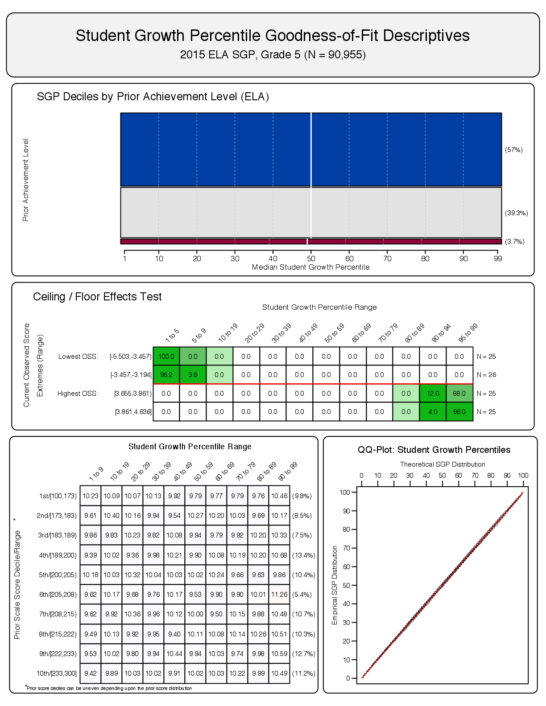

##### `r figCapNo("Goodness of Fit Plot for Grade 4 ELA, 2015.")`


##### `r figCapNo("Goodness of Fit Plot for Grade 7 ELA, 2015.")`
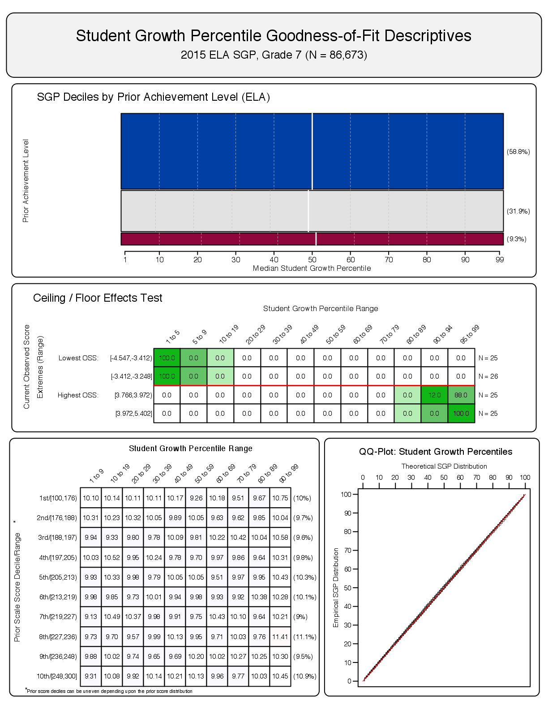

##### `r figCapNo("Goodness of Fit Plot for Grade 8 ELA, 2015.")`
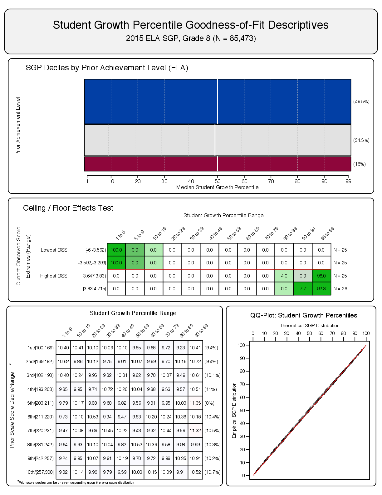

##### `r figCapNo("Goodness of Fit Plot for Grade 9 ELA, 2015.")`
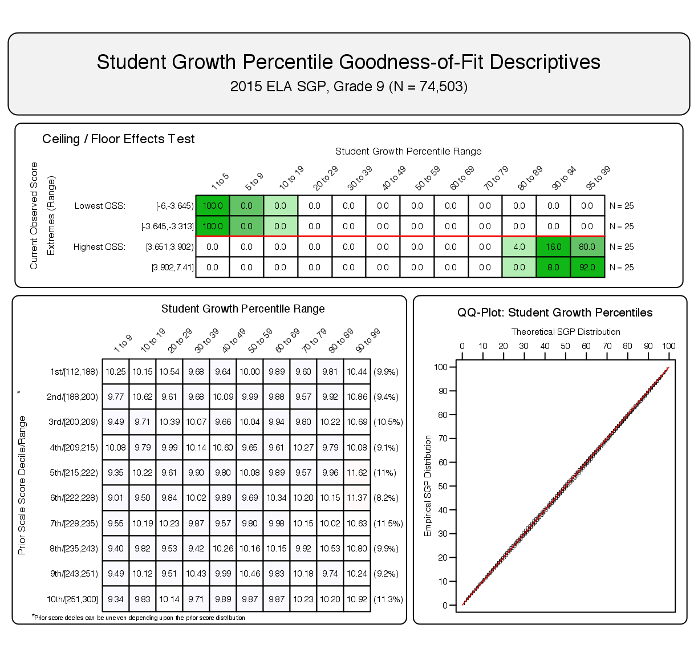

##### `r figCapNo("Goodness of Fit Plot for Grade 10 ELA, 2015.")`
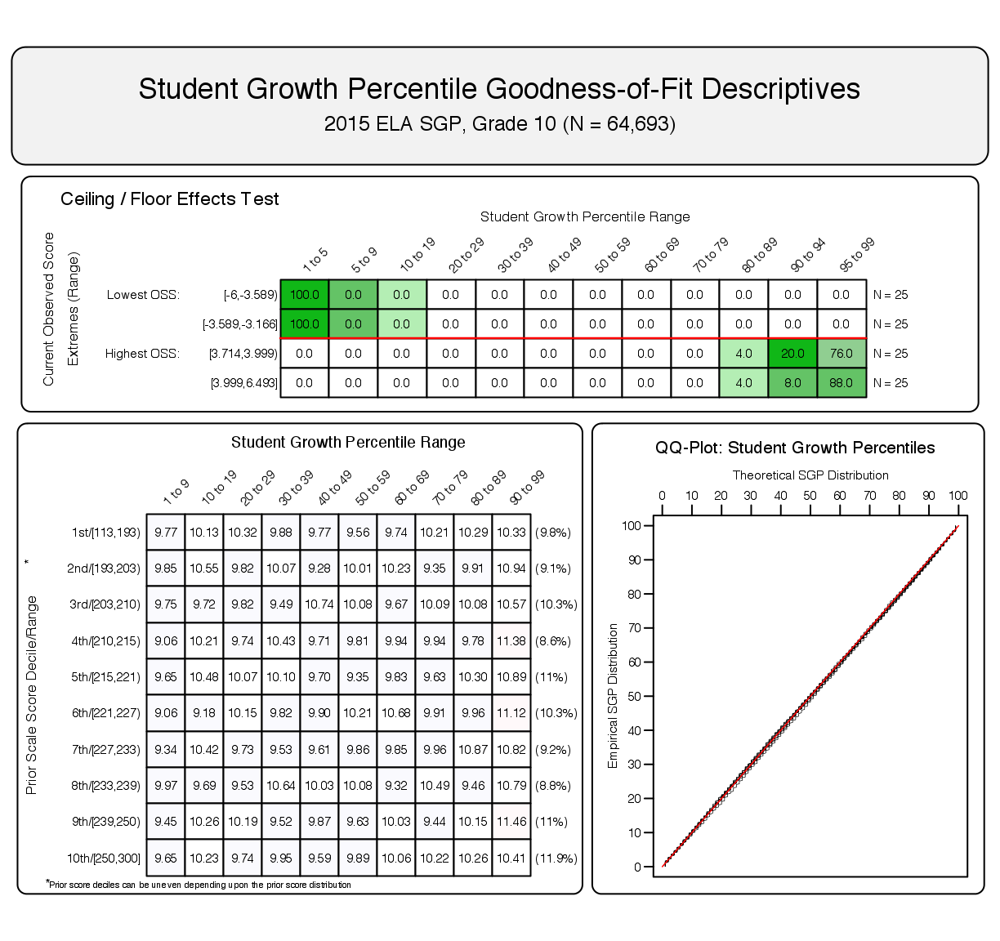

<!-- HTML_Start -->
<!-- LaTeX_Start 
\clearpage 
LaTeX_End -->


# Mathematics

<!-- HTML_Start -->
##### `r figCapNo("Goodness of Fit Plot for Grade 4 Mathematics, 2015.")`
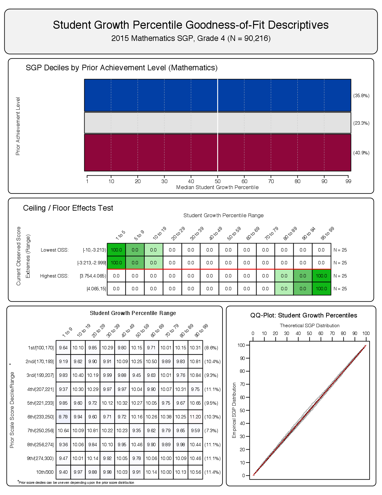

<!-- LaTeX_Start 
\begin{figure}[H]
  \begin{subfigure}[b]{0.9\textwidth}
    \includegraphics[width=\textwidth]{../img/Appendices/Goodness_of_Fit/MATHEMATICS.2015/gofSGP_Grade_4.png}
  \end{subfigure}
\caption{Goodness of Fit Plot for Grade 4 Mathematics, 2015.}
\end{figure}

\pagebreak
LaTeX_End -->


##### `r figCapNo("Goodness of Fit Plot for Grade 5 Mathematics, 2015.")`


##### `r figCapNo("Goodness of Fit Plot for Grade 6 Mathematics, 2015.")`
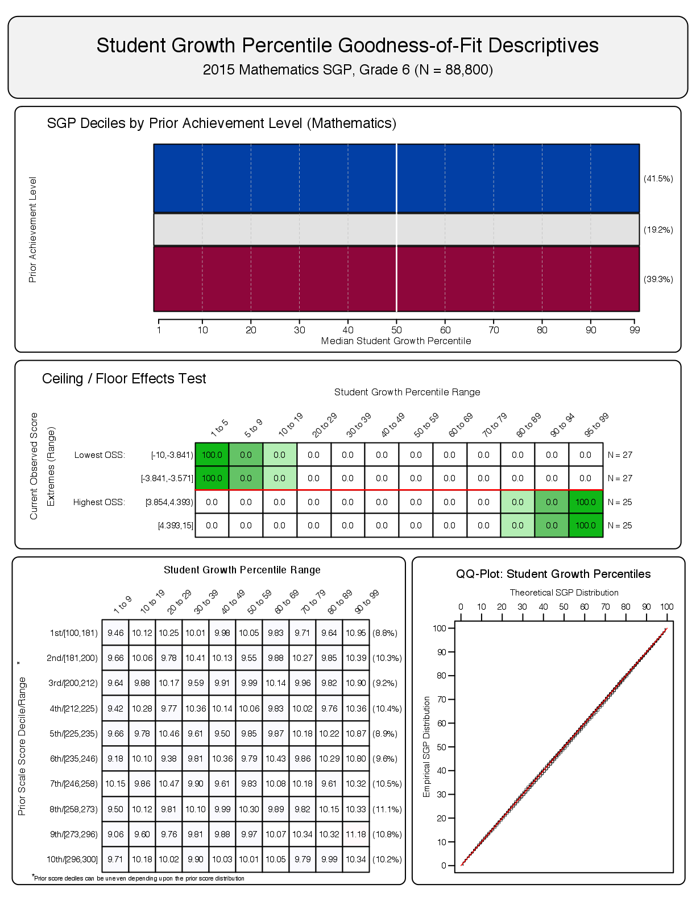

##### `r figCapNo("Goodness of Fit Plot for Grade 7 Mathematics, 2015.")`
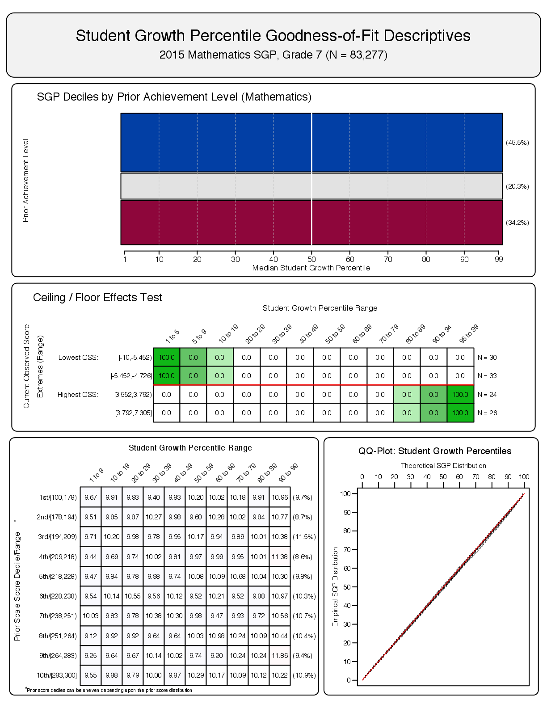

##### `r figCapNo("Goodness of Fit Plot for Grade 8 Mathematics, 2015.")`
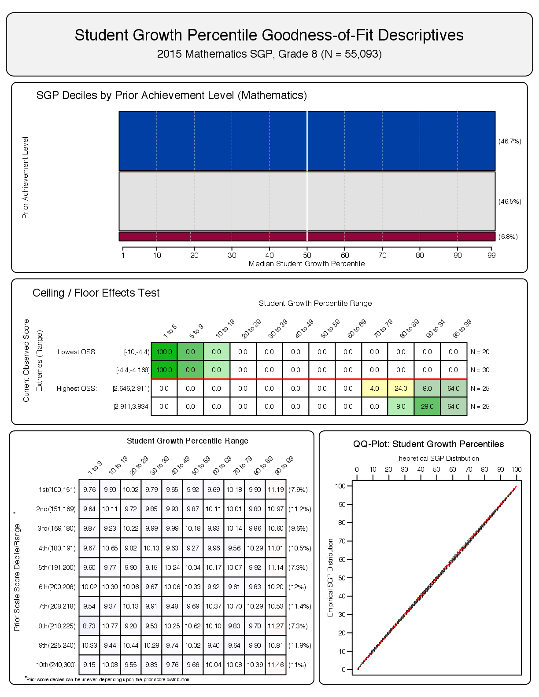

<!-- HTML_Start -->
<!-- LaTeX_Start 
\clearpage 
LaTeX_End -->


# Algebra I

<!-- HTML_Start -->
##### `r figCapNo("Goodness of Fit Plot for 2015 Algebra I: First Prior - 2014 8th Grade Math.")`


<!-- LaTeX_Start 
\begin{figure}[H]
  \begin{subfigure}[b]{0.9\textwidth}
    \includegraphics[width=\textwidth]{../img/Appendices/Goodness_of_Fit/ALGEBRA_I.2015/2015_ALGEBRA_I_EOCT;2014_MATH_8;2013_MATH_7;2012_MATH_6;2011_MATH_5;2010_MATH_4;2009_MATH_3.png}
  \end{subfigure}
\caption{Goodness of Fit Plot for 2015 Algebra I: First Prior - 2014 8th Grade Math.}
\end{figure}

\pagebreak
LaTeX_End -->

##### `r figCapNo("Goodness of Fit Plot for 2015 Algebra I: First Prior - 2014 7th Grade Math.")`


##### `r figCapNo("Goodness of Fit Plot for 2015 Algebra I: First Prior - 2013 8th Grade Math (Skipped Year Analysis).")`
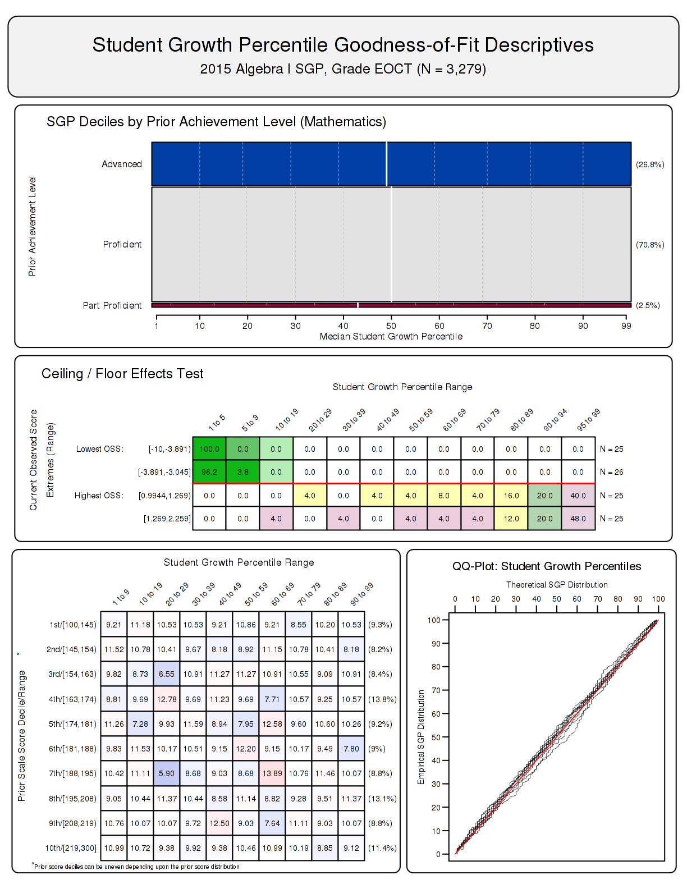

<!-- HTML_Start -->
<!-- LaTeX_Start 
\clearpage 
LaTeX_End -->


# Algebra II

<!-- HTML_Start -->
##### `r figCapNo("Goodness of Fit Plot for 2015 Algebra II: First Prior - 2013 8th Grade Math (Skipped Year Analysis).")`
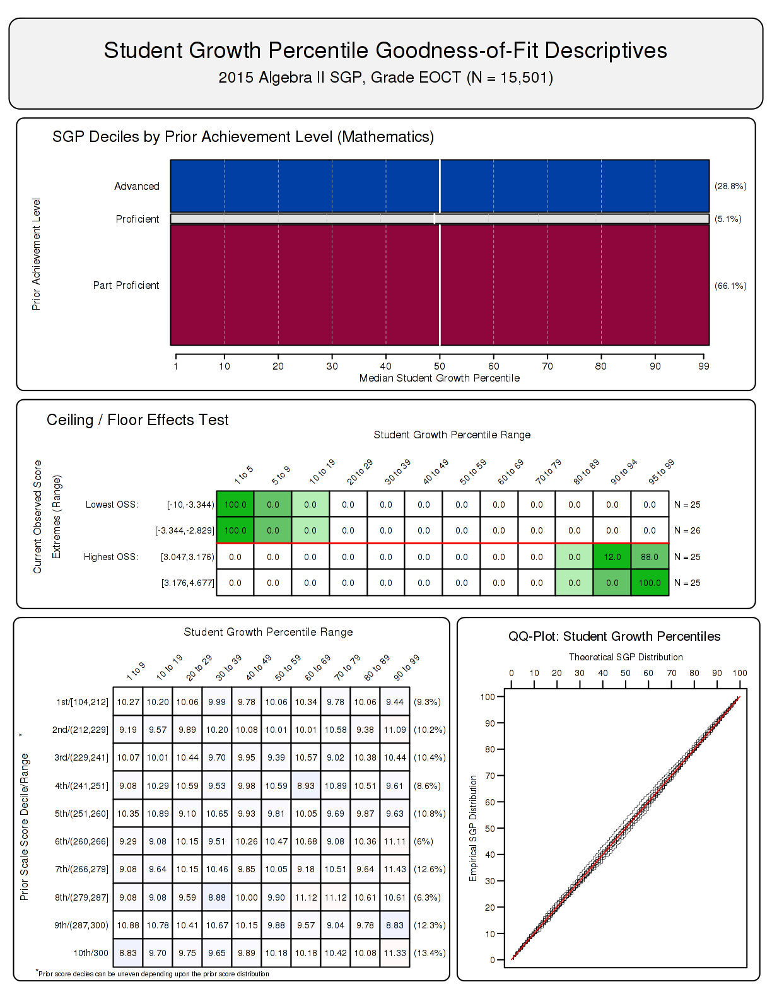

<!-- LaTeX_Start 
\begin{figure}[H]
  \begin{subfigure}[b]{0.9\textwidth}
    \includegraphics[width=\textwidth]{../img/Appendices/Goodness_of_Fit/ALGEBRA_II.2015/2015_ALGEBRA_II_EOCT;2013_MATH_8;2012_MATH_7;2011_MATH_6;2010_MATH_5;2009_MATH_4;2008_MATH_3.png}
  \end{subfigure}
\caption{Goodness of Fit Plot for 2015 Algebra II: First Prior - 2013 8th Grade Math (Skipped Year Analysis).}
\end{figure}

\pagebreak
LaTeX_End -->

# Geometry

<!-- HTML_Start -->
##### `r figCapNo("Goodness of Fit Plot for 2015 Geometry: First Prior - 2014 8th Grade Math.")`
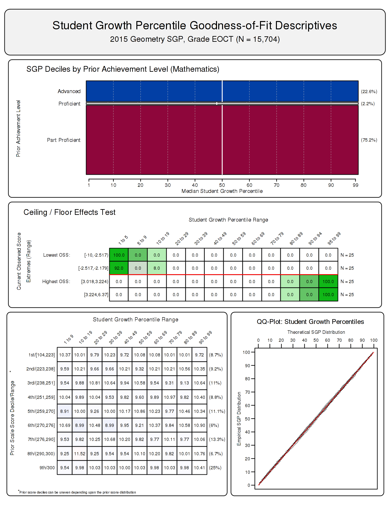

<!-- LaTeX_Start 
\begin{figure}[H]
  \begin{subfigure}[b]{0.9\textwidth}
    \includegraphics[width=\textwidth]{../img/Appendices/Goodness_of_Fit/GEOMETRY.2015/2015_GEOMETRY_EOCT;2014_MATH_8;2013_MATH_7;2012_MATH_6;2011_MATH_5;2010_MATH_4;2009_MATH_3.png}
  \end{subfigure}
\caption{Goodness of Fit Plot for 2015 Geometry: First Prior - 2014 8th Grade Math.}
\end{figure}

\pagebreak
LaTeX_End -->

##### `r figCapNo("Goodness of Fit Plot for 2015 Geometry: First Prior - 2013 8th Grade Math (Skipped Year Analysis).")`
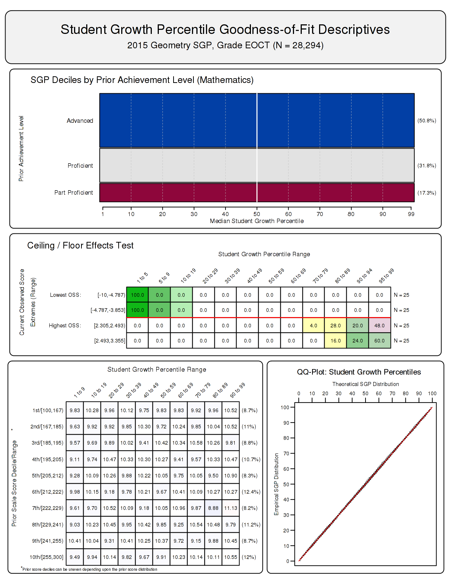
