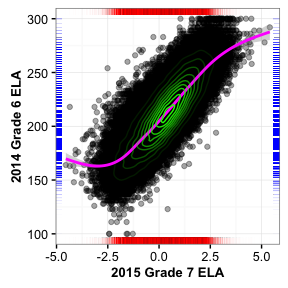
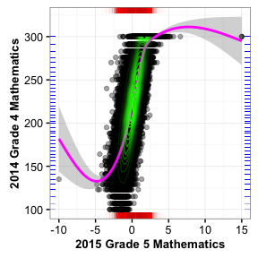
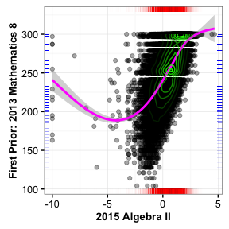
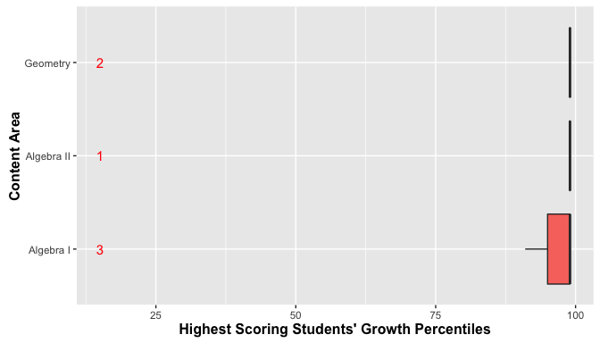

<!--SGPreport-->

```{r, echo=FALSE, include=FALSE}
  require(SGP)
  require(Gmisc)
	require(ggplot2)
	require(data.table)

  ## set a universal Cache path
  knitr::opts_chunk$set(cache.path = "_cache/Appendix_C_2015", fig.path="../img/Appendices/Appendix_C_2015/")

  ##  Set Table, Figure and Equation Counters
  options(table_counter=FALSE)
  options(table_number=0)
  options(table_counter_str = "<strong>Table C.%s:</strong> ")
  options("fig_caption_no"=0)
  options(fig_caption_no_sprintf = "**Fig. C.%s:**   %s")
  options("fig_caption_no_roman"=FALSE)
	options("equation_counter" = 0)
	
  subject_order<-c("ELA", "MATHEMATICS", 
									 "ALGEBRA_I", "ALGEBRA_II", "GEOMETRY")
	GL_subjects <- c("ELA", "MATHEMATICS")
	EOCT_subjects<-c("ALGEBRA_I", "ALGEBRA_II", "GEOMETRY")
	
	cor_subjects <- c("ELA", "MATHEMATICS", "ALGEBRA_I")

	prior.year <- "2014"
	current.year <- "2015"

	###  Set up long data
	long.data <- copy(New_Jersey_SGP@Data[, c("ID", "VALID_CASE", "CONTENT_AREA",  "GRADE", "First_Prior", "YEAR", "SCALE_SCORE", "SGP", "SCALE_SCORE_PRIOR", "SCALE_SCORE_PRIOR_STANDARDIZED", "SGP_NORM_GROUP"), with=FALSE][VALID_CASE=="VALID_CASE" & YEAR %in% c(prior.year, current.year)])

	setkeyv(long.data, c("CONTENT_AREA", "YEAR", "GRADE", "First_Prior", "SCALE_SCORE"))

	loss.hoss <- long.data[YEAR == current.year & !is.na(SGP)][, list(
		LOSS_50 = SCALE_SCORE[which.min(SCALE_SCORE)+49], #  Bottom 50 Scores
		LOSS_1 = min(SCALE_SCORE),   #  LOSS Only
		HOSS_50 = SCALE_SCORE[which.max(SCALE_SCORE)-49], #  TOP 50 Scores
		HOSS_1 = max(SCALE_SCORE)   #  HOSS Only
		), keyby=list(CONTENT_AREA, YEAR, GRADE, First_Prior)]

	setkeyv(long.data, c("CONTENT_AREA", "YEAR", "GRADE", "First_Prior"))
	long.data <- merge(long.data, loss.hoss, all.x = TRUE)
	long.data[, Grade := ordered(GRADE, levels=c(3:11, "EOCT"))]

	# tmp_prior_grade <- sapply(as.character(long.data$SGP_NORM_GROUP), function(f) tail(strsplit(tail(strsplit(f, ";")[[1]],2)[1], "_")[[1]], 1), USE.NAMES=FALSE)

	##  Subset out all students with max score and their historical long data

	max.data <- data.table(long.data[SCALE_SCORE >= HOSS_50 & !is.na(SGP),], key=c("ID", "CONTENT_AREA", "GRADE", "First_Prior"))
	max.data[, CA := gsub("Sec ", "Secondary ", sapply(CONTENT_AREA, capwords))]
	min.data <- data.table(long.data[SCALE_SCORE <= LOSS_50 & !is.na(SGP),], key=c("ID", "CONTENT_AREA", "GRADE", "First_Prior"))
	min.data[, CA := gsub("Sec ", "Secondary ", sapply(CONTENT_AREA, capwords))]

	###
	###  Utility functions for ggplot (necessary because use of ggplot(...) withing knitr is odd - can't find defined variables in envir/scope, just like data.table)
	###
	
	condDistPlot <- function(ca, g, prior.ca = NULL) {
		if (g == "EOCT") {
			tmp.data <- subset(long.data, YEAR==current.year & CONTENT_AREA==ca & First_Prior==prior.ca & !is.na(SCALE_SCORE_PRIOR), select=c(ID, SCALE_SCORE, SCALE_SCORE_PRIOR))
			x.lab <- paste(current.year, gsub("Sec ", "Secondary ", capwords(ca)))
			y.lab <- paste(c("First Prior:", sapply(strsplit(prior.ca, "/")[[1]], capwords)), collapse = " ")
		}	else {
			tmp.data <- subset(long.data, YEAR==current.year & CONTENT_AREA==ca & GRADE==g & !is.na(SCALE_SCORE_PRIOR), select=c(ID, SCALE_SCORE, SCALE_SCORE_PRIOR))
			x.lab <- paste(current.year, "Grade", g, capwords(ca))
			if (is.null(prior.ca)) prior.ca <- ca
			y.lab <- paste(prior.year, "Grade", g-1, capwords(prior.ca))
		}

		ggplot(tmp.data, aes(x=SCALE_SCORE, y=SCALE_SCORE_PRIOR)) + geom_point(alpha=0.35) + theme_bw() + 
			geom_smooth(aes(x=SCALE_SCORE), colour='magenta', method="gam", formula =y ~ s(x, bs = "cs")) + 
			geom_rug(sides="tb", size=0.05, col=rgb(0.8,0,0,alpha=0.05)) + geom_rug(sides="rl", size=0.05, col=rgb(0,0,0.8,alpha=0.05)) +
			stat_density2d(data=tmp.data, geom="density2d",  aes(alpha = ..level..), colour='green', contour = TRUE) + #, size=1
			labs(y = y.lab, x = x.lab) + theme(axis.title=element_text(size=10, face="bold"), legend.position="none")
	}

	boxPlot <- function(tmp.data, y, LOSS=FALSE, facet=NULL) {
		give.n <- function(x) { return(c(y = y, label = length(x))) }
		if (is.null(facet)) {
			if (LOSS) {
				p <- ggplot(data=tmp.data, aes(x=CA, y=SGP, fill=CA, ymax=(min(SGP) +7))) + 
						 geom_boxplot() + labs(x="Content Area", y="Lowest Scoring Students' Growth Percentiles")
			} else {
				p <- ggplot(data=tmp.data, aes(x=CA, y=SGP, fill=CA, ymax=(min(SGP) -7))) + 
						 geom_boxplot() + labs(x="Content Area", y="Highest Scoring Students' Growth Percentiles")
			}
			p + stat_summary(fun.data = give.n, geom = "text", position=position_dodge(width = 0.75), size=4, colour="red") +
					coord_flip() + theme(axis.title=element_text(size=12,face="bold"), legend.position="none")
		} else {
		if (facet=="Grade") {
			if (LOSS) {
				p <- ggplot(data=tmp.data, aes(x=CA, y=SGP, fill=Grade, ymax=(min(SGP) +10))) + 
						 geom_boxplot() + facet_grid(.~CA, scales="free") + labs(x="", y="Lowest Scoring Students' Growth Percentiles") 
			} else {
				p <- ggplot(data=tmp.data, aes(x=CA, y=SGP, fill=Grade, ymax=(min(SGP) -10))) + 
						 geom_boxplot() + facet_grid(.~CA, scales="free") + labs(x="", y="Highest Scoring Students' Growth Percentiles") 
			}
			p + stat_summary(fun.data = give.n, geom = "text", position=position_dodge(0.75), size=4, colour="red") +
					coord_flip() + theme(axis.title=element_text(size=12,face="bold"), axis.text.y = element_blank()) # +
		} else {
			###  Facet is either Grade or First_Prior
			if (LOSS) {
				p <- ggplot(data=tmp.data, aes(x=CA, y=SGP, fill=First_Prior, ymax=(min(SGP) +10))) + 
						 geom_boxplot() + facet_grid(.~CA, scales="free") + labs(x="", y="Lowest Scoring Students' Growth Percentiles") 
			} else {
				p <- ggplot(data=tmp.data, aes(x=CA, y=SGP, fill=First_Prior, ymax=(min(SGP) -10))) + 
						 geom_boxplot() + facet_grid(.~CA, scales="free") + labs(x="", y="Highest Scoring Students' Growth Percentiles") 
			}
			p + stat_summary(fun.data = give.n, geom = "text", position=position_dodge(0.75), size=4, colour="red") +
					coord_flip() + theme(axis.title=element_text(size=12,face="bold"), axis.text.y = element_blank()) # +
		}}
	}
```


# Introduction
In the 2014-2015 academic year, New Jersey transitioned from the New Jersey Assessment of Skills and Knowledge (NJASK) to the [Partnership for Assessment of Readiness for College and Careers (PARCC)](http://www.parcconline.org/).  The transition included numerous changes to the assessment system including the incorporation of new performance standards.  As other states have gone through similar assessment transitions, many have observed ceiling and floor effects in the new assessments (i.e. a relatively large proportion of students scoring at/near the scale extremes).  This has occurred despite purported improvements in assessment qualities that should prevent these effects (e.g. adaptive tests).  Regardless of the source of assessment ceilings/floors, they can telegraph onto the Student Growth Percentile (SGP) calculations making these estimates questionable.

Although very similar in nature, ceiling effects are somewhat more problematic than floor effects because students that consistently achieve the highest scores receive lower than expected growth percentiles and are therefore negatively impacted.  Conversely, the consistently lowest achieving students have higher estimated SGPs than would be expected.  Although this could be interpreted as a positive impact for these students by giving them higher SGPs, it can also conceal unacceptably low growth that needs to be identified and addressed.

Essentially these problems are caused by the way in which a "percentile" is defined to begin with, and the inability of the assessments (and therefore the SGP model) to make granular distinctions between kids who score at the extremes of the test year after year.  As an example, if a group of students were tested with a relatively easy test and 20% of the students had a perfect score, these students would be defined as being in the 80<sup>th</sup> percentile because they scored higher than 80% of their peers.  This is somewhat misleading however, because their score was *equal to* or greater than 100% of their peers and so could be also described as achieving at the 99.99<sup>th</sup> percentile under an equally valid definition.

To extend this heuristic from achievement to growth, if 50% of those top students also scored perfectly on the next test, we might estimate that they had 50<sup>th</sup> percentile growth.  Although there is nothing *technically* incorrect about this estimate because their growth is fairly typical for their academic peer group, it is an inadequate or unsatisfactory assessment of their growth because they have consistently attained at the highest observable level.  Furthermore, if it is typical for their peers to maintain perfect scores then even small deviations from a perfect score could produce *low growth* SGP estimates.

Given these impacts and the difficulty in detecting them using traditional SGP diagnostic tools, the Center for Assessment has added "Ceiling/Test Effects" indicators to the SGP model goodness of fit plots and is providing all clients even more rigorous diagnostic and descriptive analyses through this Appendix to the annual technical report.  This report includes:

1. Plots of the scale score distributions for the current and prior years' tests, which may provide an indication of whether a ceiling or floor is present in either (or both) the current or historical data.
2. Box plots showing the range and distribution of SGPs for *only* the highest and lowest achieving students in the current year.

<!-- HTML_Start -->
<!-- <div class='breakboth' ></div> -->
<!-- LaTeX_Start 
\pagebreak
LaTeX_End -->


# Prior and Current Year Score Distributions
The marginal and conditional distributions of scale scores can serve as a preliminary indicator of potential ceiling or floor effects in the calculation of student growth percentiles.  Some minor problems could present themselves if these characteristics are present in either prior or current year scores, and are particularly likely when present in both.  The plots below depict distributions for the current year and the most recent prior year used in the SGP calculations.  The marginal (individual or univariate) distributions for each year are shown in the first subsections below, followed by the conditional (joint) distributions.  Each content area plots are disaggregated by grade.

## Marginal Distributions
Generally there is evidence of ceiling effects across all grades and in both subjects in the NJASK prior scores (although it is more prominent in the Mathematics tests).  These effects appear either as fat, truncated tails or as sharp spikes in the distribution at the extreme right side of the distributions.  

The NJASK ELA scores display fat tails and the Mathematics score distributions are truncated with sharp spikes at the upper end of the distributions, both of which suggest that there may be issues with students consistently achieving maximum scores.  This could potentially translate to ceiling effects in growth analyses.

```{r, echo=FALSE, include=FALSE, margDist_Prior, cache=TRUE, fig.height=3.75, fig.width=7}
#  Loop around subjects to produce plots:  - NOPE!  For some reason for loops don't work in knitr ...  No plots produced in code chunk
	ggplot(data=data.table(long.data[CONTENT_AREA=="ELA" & YEAR == prior.year & GRADE %in% 3:7,][, list(ID, SCALE_SCORE, Grade)], key=c("ID", "SCALE_SCORE")), 
			 aes(x= SCALE_SCORE, y = ..count..)) + geom_density(alpha=0.5, fill=rgb(0,0,0.8)) + facet_wrap(~ Grade, scales="free_x", ncol=3) + 
		labs(x='\nPrior Year Scale Scores') + theme(axis.title=element_text(size=12,face="bold"), legend.position = "none") 

	ggplot(data=data.table(long.data[CONTENT_AREA=="MATHEMATICS" & YEAR == prior.year & GRADE %in% 3:7,][, list(ID, SCALE_SCORE, Grade)], key=c("ID", "SCALE_SCORE")), 
			 aes(x= SCALE_SCORE, y = ..count..)) + geom_density(alpha=0.5, fill=rgb(0,0,0.8)) + facet_wrap(~ Grade, scales="free_x", ncol=3) + 
		labs(x='\nPrior Year Scale Scores') + theme(axis.title=element_text(size=12,face="bold"), legend.position = "none") 
```
```{r, echo=FALSE, include=FALSE, margDist_Crnt, cache=TRUE, fig.height=3.75, fig.width=7}
	ggplot(data=data.table(long.data[CONTENT_AREA=="ELA" & YEAR == current.year & GRADE %in% 4:8,][, list(ID, SCALE_SCORE, Grade)], key=c("ID", "SCALE_SCORE")), 
			 aes(x= SCALE_SCORE, y = ..count..)) + geom_density(alpha=0.5, fill=rgb(0.8,0,0)) + facet_wrap(~ Grade, scales="free_x", ncol=3) + 
		labs(x='\nCurrent Year Scale Scores') + theme(axis.title=element_text(size=12,face="bold"), legend.position = "none") 

	ggplot(data=data.table(long.data[CONTENT_AREA=="MATHEMATICS" & YEAR == current.year & GRADE %in% 4:8,][, list(ID, SCALE_SCORE, Grade)], key=c("ID", "SCALE_SCORE")), 
			 aes(x= SCALE_SCORE, y = ..count..)) + geom_density(alpha=0.5, fill=rgb(0.8,0,0)) + facet_wrap(~ Grade, scales="free_x", ncol=3) + 
		labs(x='\nCurrent Year Scale Scores') + theme(axis.title=element_text(size=12,face="bold"), legend.position = "none") 

	ggplot(data=data.table(long.data[CONTENT_AREA=="ALGEBRA_I" & YEAR == current.year,][, list(ID, SCALE_SCORE, Grade)], key=c("ID", "SCALE_SCORE")), 
			 aes(x= SCALE_SCORE, y = ..count..)) + geom_density(alpha=0.5, fill=rgb(0.8,0,0)) + facet_wrap(~ Grade, scales="free_x", ncol=3) + 
		labs(x='\nCurrent Year Scale Scores') + theme(axis.title=element_text(size=12,face="bold"), legend.position = "none") 

	ggplot(data=data.table(long.data[CONTENT_AREA=="GEOMETRY" & YEAR == current.year,][, list(ID, SCALE_SCORE, Grade)], key=c("ID", "SCALE_SCORE")), 
			 aes(x= SCALE_SCORE, y = ..count..)) + geom_density(alpha=0.5, fill=rgb(0.8,0,0)) + facet_wrap(~ Grade, scales="free_x", ncol=3) + 
		labs(x='\nCurrent Year Scale Scores') + theme(axis.title=element_text(size=12,face="bold"), legend.position = "none") 

	ggplot(data=data.table(long.data[CONTENT_AREA=="ALGEBRA_II" & YEAR == current.year,][, list(ID, SCALE_SCORE, Grade)], key=c("ID", "SCALE_SCORE")), 
			 aes(x= SCALE_SCORE, y = ..count..)) + geom_density(alpha=0.5, fill=rgb(0.8,0,0)) + facet_wrap(~ Grade, scales="free_x", ncol=3) + 
		labs(x='\nCurrent Year Scale Scores') + theme(axis.title=element_text(size=12,face="bold"), legend.position = "none") 
```

### ELA

<!-- HTML_Start -->
##### `r figCapNo("Marginal distributions of prior scale scores:  EOGT ELA.")`


##### `r figCapNo("Marginal distributions of current scale scores:  EOGT ELA.")`


<!-- LaTeX_Start 
\begin{figure}[H]
\caption*{\label{fig:Bidensity} {\bf{Fig. C.1:}} Marginal distributions of prior scale scores:  EOGT ELA.}
  \begin{subfigure}[b]{\textwidth}
    \includegraphics[width=\textwidth]{../img/Appendices/Appendix_C_2015/margDist_Prior-1.png}
  \end{subfigure}
\end{figure}

\begin{figure}[H]
\caption*{\label{fig:Bidensity} {\bf{Fig. C.2:}} Marginal distributions of current scale scores:  EOGT ELA.}
  \begin{subfigure}[b]{\textwidth}
    \includegraphics[width=\textwidth]{../img/Appendices/Appendix_C_2015/margDist_Crnt-1.png}
  \end{subfigure}
\end{figure}

\pagebreak
LaTeX_End -->


###  Mathematics

<!-- HTML_Start -->
##### `r figCapNo("Marginal distributions of prior scale scores:  EOGT Mathematics.")`


##### `r figCapNo("Marginal distributions of current scale scores:  EOGT Mathematics.")`


<!-- LaTeX_Start 
\begin{figure}[H]
\caption*{\label{fig:Bidensity} {\bf{Fig. C.3:}} Marginal distributions of prior scale scores:  EOGT Mathematics.}
  \begin{subfigure}[b]{\textwidth}
    \includegraphics[width=\textwidth]{../img/Appendices/Appendix_C_2015/margDist_Prior-2.png}
  \end{subfigure}
\end{figure}

\begin{figure}[H]
\caption*{\label{fig:Bidensity} {\bf{Fig. C.4:}} Marginal distributions of current scale scores:  EOGT Mathematics.}
  \begin{subfigure}[b]{\textwidth}
    \includegraphics[width=\textwidth]{../img/Appendices/Appendix_C_2015/margDist_Crnt-2.png}
  \end{subfigure}
\end{figure}

\pagebreak
LaTeX_End -->

###  EOCT Mathematics

<!-- HTML_Start -->
##### `r figCapNo("Marginal distributions of current scale scores:  Algebra I.")`


<!-- LaTeX_Start 
\begin{figure}[H]
\caption*{\label{fig:Bidensity} {\bf{Fig. C.5:}} Marginal distributions of current scale scores:  Algebra I.}
  \begin{subfigure}[b]{\textwidth}
    \includegraphics[width=\textwidth]{../img/Appendices/Appendix_C_2015/margDist_Crnt-3.png}
  \end{subfigure}
\end{figure}

LaTeX_End -->

<!-- HTML_Start -->
##### `r figCapNo("Marginal distributions of current scale scores:  Geometry.")`


<!-- LaTeX_Start 
\begin{figure}[H]
\caption*{\label{fig:Bidensity} {\bf{Fig. C.5:}} Marginal distributions of current scale scores:  Geometry.}
  \begin{subfigure}[b]{\textwidth}
    \includegraphics[width=\textwidth]{../img/Appendices/Appendix_C_2015/margDist_Crnt-4.png}
  \end{subfigure}
\end{figure}

LaTeX_End -->
<!-- HTML_Start -->

##### `r figCapNo("Marginal distributions of current scale scores:  Algebra II.")`


<!-- LaTeX_Start 
\begin{figure}[H]
\caption*{\label{fig:Bidensity} {\bf{Fig. C.5:}} Marginal distributions of current scale scores:  Algebra II.}
  \begin{subfigure}[b]{\textwidth}
    \includegraphics[width=\textwidth]{../img/Appendices/Appendix_C_2015/margDist_Crnt-5.png}
  \end{subfigure}
\end{figure}

\pagebreak
LaTeX_End -->


## Conditional Distributions
The marginal density plots provide a limited amount of information, particularly for the potential for ceiling/floor effects in the calculation of ***growth***.  In order to provide a more nuanced view of the relationship between the prior and current scale scores, the following plots depict the conditional (joint) distributions for each content area and grade level.  These plots start with a basic scatter plot of each student's scores, and on top of this is layered 1) **green contour lines** to provide a sense of the joint density, 2) a **magenta non-linear line** identifying the bivariate relationship between prior and current scores, and 3) **rug plots** that describe the marginal distributions (as above, the prior scores are blue and current scores are red).  

When ceiling or floor effects are present, they present themselves as dark shaded points in the extreme top-right or bottom-left corners of the plots.  This suggests that staying at the extremes from year to year is not uncommon, which may lead to odd growth estimates for these chronically high/low achieving students.
For the 2014 and 2015 New Jersey data, we again see very few issues in all content area and grade combinations.  Where minor ceiling/floor effects appear in the prior year (NJASK) data, the 2015 score distributions for these students are well distributed.  That is, in plots in which a minor shaded point in the upper right corners are present the other students who scored at the HOSS on the 2014 NJASK tests had a wide range if PARCC scores, which lessens the concern for a ceiling effect^[Again, only when these academic peer groups are clustered in the HOSS/LOSS year after year do we encounter problems.].

```{r, echo=FALSE, include=FALSE, condDist_EOGT, cache=TRUE, fig.height=3, fig.width=3}
#  Loop around subjects to produce plots:
	condDistPlot(ca="ELA", g=4)
	condDistPlot(ca="ELA", g=5)
	condDistPlot(ca="ELA", g=6)
	condDistPlot(ca="ELA", g=7)
	condDistPlot(ca="ELA", g=8)
	condDistPlot(ca="ELA", g=9)
	# condDistPlot(ca="ELA", g=10)
	condDistPlot(ca="ELA", g="EOCT", prior.ca = "2013/ELA_8") # Grade 10

	condDistPlot(ca="MATHEMATICS", g=4)
	condDistPlot(ca="MATHEMATICS", g=5)
	condDistPlot(ca="MATHEMATICS", g=6)
	condDistPlot(ca="MATHEMATICS", g=7)
	condDistPlot(ca="MATHEMATICS", g=8)
	
	# table(long.data[CONTENT_AREA=="ALGEBRA_II"]$First_Prior)
	condDistPlot(ca="ALGEBRA_I", g="EOCT", prior.ca="2014/MATHEMATICS_8")
	condDistPlot(ca="ALGEBRA_I", g="EOCT", prior.ca="2014/MATHEMATICS_7")
	condDistPlot(ca="ALGEBRA_I", g="EOCT", prior.ca="2013/MATHEMATICS_8")

	condDistPlot(ca="ALGEBRA_II", g="EOCT", prior.ca="2013/MATHEMATICS_8")

	condDistPlot(ca="GEOMETRY", g="EOCT", prior.ca="2014/MATHEMATICS_8")
	condDistPlot(ca="GEOMETRY", g="EOCT", prior.ca="2013/MATHEMATICS_8")
```

###  ELA

<!-- HTML_Start -->
##### `r figCapNo("Conditional distribution(s) of current and prior scale scores:  EOGT ELA.")`
  
 

##### `r figCapNo("Conditional distribution(s) of current and prior scale scores:  EOGT ELA <em>Continued</em>.")`
  

<!-- LaTeX_Start 
\begin{figure}[H]
\caption*{\label{fig:condDistELA} {\bf{Fig. C.6:}} Conditional distribution(s) of current and prior scale scores:  EOGT ELA.}
  \begin{subfigure}[b]{0.5\textwidth}
    \includegraphics[width=\textwidth]{../img/Appendices/Appendix_C_2015/condDist_EOGT-1.png}
  \end{subfigure}
  \begin{subfigure}[b]{0.5\textwidth}
    \includegraphics[width=\textwidth]{../img/Appendices/Appendix_C_2015/condDist_EOGT-2.png}
  \end{subfigure}
  %
  \begin{subfigure}[b]{0.5\textwidth}
    \includegraphics[width=\textwidth]{../img/Appendices/Appendix_C_2015/condDist_EOGT-3.png}
  \end{subfigure}
  \begin{subfigure}[b]{0.5\textwidth}
    \includegraphics[width=\textwidth]{../img/Appendices/Appendix_C_2015/condDist_EOGT-4.png}
  \end{subfigure}
\end{figure}

\pagebreak

\begin{figure}[H]
\caption*{\label{fig:condDistELA2} {\bf{Fig. C.7:}} Conditional distribution(s) of current and prior scale scores:  EOGT ELA \textit{Continued}.}
  \begin{subfigure}[b]{0.5\textwidth}
    \includegraphics[width=\textwidth]{../img/Appendices/Appendix_C_2015/condDist_EOGT-5.png}
  \end{subfigure}
  \begin{subfigure}[b]{0.5\textwidth}
    \includegraphics[width=\textwidth]{../img/Appendices/Appendix_C_2015/condDist_EOGT-6.png}
  \end{subfigure}
  %
  \begin{subfigure}[b]{0.5\textwidth}
    \includegraphics[width=\textwidth]{../img/Appendices/Appendix_C_2015/condDist_EOGT-7.png}
  \end{subfigure}
\end{figure}

\pagebreak
LaTeX_End -->


###  Grade Level and EOCT Mathematics

<!-- HTML_Start -->
##### `r figCapNo("Conditional distribution(s) of current and prior scale scores:  EOGT Mathematics.")`
  
  


##### `r figCapNo("Conditional distribution(s) of current and prior scale scores:  Grade 8 Mathematics and Algebra I.")`
  
  

##### `r figCapNo("Conditional distribution(s) of current and prior scale scores:  EOCT Algebra II and Geometry.")`
  


<!-- LaTeX_Start 
\begin{figure}[H]
\caption*{\label{fig:condDistMath} {\bf{Fig. C.8:}} Conditional distribution(s) of current and prior scale scores:  Grades 4-7 Mathematics.}
  \begin{subfigure}[b]{0.5\textwidth}
    \includegraphics[width=\textwidth]{../img/Appendices/Appendix_C_2015/condDist_EOGT-8.png}
  \end{subfigure}
  \begin{subfigure}[b]{0.5\textwidth}
    \includegraphics[width=\textwidth]{../img/Appendices/Appendix_C_2015/condDist_EOGT-9.png}
  \end{subfigure}
  %
  \begin{subfigure}[b]{0.5\textwidth}
    \includegraphics[width=\textwidth]{../img/Appendices/Appendix_C_2015/condDist_EOGT-10.png}
  \end{subfigure}
  \begin{subfigure}[b]{0.5\textwidth}
    \includegraphics[width=\textwidth]{../img/Appendices/Appendix_C_2015/condDist_EOGT-11.png}
  \end{subfigure}
\end{figure}

\pagebreak

\begin{figure}[H]
\caption*{\label{fig:condDistMath2} {\bf{Fig. C.9:}} Conditional distribution(s) of current and prior scale scores: Grade 8 Mathematics and EOCT Algebra I.}
  \begin{subfigure}[b]{0.5\textwidth}
    \includegraphics[width=\textwidth]{../img/Appendices/Appendix_C_2015/condDist_EOGT-12.png}
  \end{subfigure}
  \begin{subfigure}[b]{0.5\textwidth}
    \includegraphics[width=\textwidth]{../img/Appendices/Appendix_C_2015/condDist_EOGT-13.png}
  \end{subfigure}
  %
  \begin{subfigure}[b]{0.5\textwidth}
    \includegraphics[width=\textwidth]{../img/Appendices/Appendix_C_2015/condDist_EOGT-14.png}
  \end{subfigure}
  \begin{subfigure}[b]{0.5\textwidth}
    \includegraphics[width=\textwidth]{../img/Appendices/Appendix_C_2015/condDist_EOGT-15.png}
  \end{subfigure}
\end{figure}

\pagebreak

\begin{figure}[H]
\caption*{\label{fig:condDistMath3} {\bf{Fig. C.10:}} Conditional distribution(s) of current and prior scale scores: EOCT Algebra II and Geometry.}
  \begin{subfigure}[b]{0.5\textwidth}
    \includegraphics[width=\textwidth]{../img/Appendices/Appendix_C_2015/condDist_EOGT-16.png}
  \end{subfigure}
  \begin{subfigure}[b]{0.5\textwidth}
    \includegraphics[width=\textwidth]{../img/Appendices/Appendix_C_2015/condDist_EOGT-17.png}
  \end{subfigure}
  \begin{subfigure}[b]{0.5\textwidth}
    \includegraphics[width=\textwidth]{../img/Appendices/Appendix_C_2015/condDist_EOGT-18.png}
  \end{subfigure}
\end{figure}

\clearpage
\pagebreak

LaTeX_End -->


# SGP Ranges for the Highest and Lowest Achieving Students

In order to isolate the impact of assessment ceilings/floors on student growth percentile (SGP) calculations, the following section provides box plots of the distribution of SGPs for the highest and lowest achieving students.  We are specifically interested in the SGPs for students scoring at the highest/lowest obtainable scale score (HOSS/LOSS - i.e. the actual ceiling/floor).  However, in order to assure that an adequate number of students are included in these plots, the first set of plots in each subsection uses, at a *minimum*, the highest/lowest 50 scores.  Note that this roughly corresponds to the number of students used in the SGP model goodness of fit plots, and this is why these plots are provided as a starting point for this part of the investigation.  All students with a score in these students' range of scores are included.  Consequently, the number of students in each box plot may be greater than 50 (the exact number is shown at the margins in red text).

The second set of box plots in the following subsections isolate ***only*** those students scoring the HOSS/LOSS.  These plots may then incorporate a widely varying number of students depending on the prevalence of a ceiling/floor in the current year.

The box plots provide several descriptive statistics.  The dark line within the box marks the *median* SGP, while the ends ("hinges") of the boxes correspond to the first and third quartiles (the 25<sup>th</sup> and 75<sup>th</sup> percentiles).  The upper whisker extends from the hinge to the highest value that is within 1.5 $\times$ IQR of the hinge, where IQR is the inter-quartile range, or distance between the first and third quartiles. The lower whisker extends from the hinge to the lowest value within 1.5 $\times$ IQR of the hinge. Data beyond the end of the whiskers are outliers and plotted as points.  Evidence of a *lack* of either a ceiling or floor effect would be to have all high achieving students with SGPs near 99 and all low achieving students with SGPs near 1.  That is, the desired visual evidence is a solid line at SGP = 99/1.

In the 2015 New Jersey EOGT SGP analyses, we see evidence of a very minor ceiling effect in 6th grade mathematics and some floor effects in Algebra I.  However, these issues are present when considering the top 50 students' scores, but both disappear when considering only the HOSS/LOSS scores.

```{r, echo=FALSE, include=FALSE, cache=TRUE, HOSS_Box_EOGT, fig.height=4, fig.width=7}
	min.ceiling<-min(max.data[CONTENT_AREA %in% GL_subjects]$SGP) -5
	boxPlot(tmp.data=max.data[CONTENT_AREA %in% GL_subjects], min.ceiling, facet="Grade")
	boxPlot(tmp.data=max.data[CONTENT_AREA %in% GL_subjects & SCALE_SCORE==HOSS_1], min.ceiling, facet="Grade")
```
```{r, echo=FALSE, include=FALSE, cache=TRUE, LOSS_Box_EOGT, fig.height=4, fig.width=7}
	max.floor <- max(min.data[CONTENT_AREA %in% GL_subjects]$SGP)
	boxPlot(tmp.data=min.data[CONTENT_AREA %in% GL_subjects], max.floor +5, LOSS=TRUE, facet="Grade")
	boxPlot(tmp.data=min.data[CONTENT_AREA %in% GL_subjects & SCALE_SCORE==LOSS_1], max.floor, LOSS=TRUE, facet="Grade")
```

```{r, echo=FALSE, include=FALSE, cache=TRUE, HOSS_Box_EOCT, fig.height=4, fig.width=7}
	min.ceiling<-min(max.data[CONTENT_AREA %in% EOCT_subjects]$SGP)
	boxPlot(tmp.data=max.data[CONTENT_AREA %in% EOCT_subjects], min.ceiling -4)
	boxPlot(tmp.data=max.data[CONTENT_AREA %in% EOCT_subjects & SCALE_SCORE==HOSS_1], min.ceiling)
	boxPlot(tmp.data=max.data[CONTENT_AREA %in% "ALGEBRA_I"], min.ceiling -4, facet="First_Prior")
	boxPlot(tmp.data=max.data[CONTENT_AREA %in% "GEOMETRY"], min.ceiling -4, facet="First_Prior")
```
```{r, echo=FALSE, include=FALSE, cache=TRUE, LOSS_Box_EOCT, fig.height=4, fig.width=7}
	max.floor <- max(min.data[CONTENT_AREA %in% EOCT_subjects]$SGP)
	boxPlot(tmp.data=min.data[CONTENT_AREA %in% EOCT_subjects], max.floor +4, LOSS=TRUE)
	boxPlot(tmp.data=min.data[CONTENT_AREA %in% EOCT_subjects & SCALE_SCORE==LOSS_1], max.floor, LOSS=TRUE)
```

## EOGT Content Areas

<!-- HTML_Start -->
##### `r figCapNo("SGP distributions for highest and lowest 50+ scale scores by content area and grade level.")`


##### `r figCapNo("SGP distributions for the HOSS and LOSS scores by content area and grade level.")`


<!-- LaTeX_Start 
\begin{figure}[H]
\caption*{\label{fig:boxPlotEOGT} {\bf{Fig. C.10:}} SGP distributions for highest and lowest 50+ scale scores by content area and grade level.}
  \begin{subfigure}[b]{\textwidth}
    \includegraphics[width=\textwidth]{../img/Appendices/Appendix_C_2015/HOSS_Box_EOGT-1.png}
  \end{subfigure}
  \begin{subfigure}[b]{\textwidth}
    \includegraphics[width=\textwidth]{../img/Appendices/Appendix_C_2015/LOSS_Box_EOGT-1.png}
  \end{subfigure}
\end{figure}

\begin{figure}[H]
\caption*{\label{fig:boxPlotEOGT2} {\bf{Fig. C.11:}} SGP distributions for the HOSS and LOSS scores by content area and grade level.}
  \begin{subfigure}[b]{\textwidth}
    \includegraphics[width=\textwidth]{../img/Appendices/Appendix_C_2015/HOSS_Box_EOGT-2.png}
  \end{subfigure}
  \begin{subfigure}[b]{\textwidth}
    \includegraphics[width=\textwidth]{../img/Appendices/Appendix_C_2015/LOSS_Box_EOGT-2.png}
  \end{subfigure}
\end{figure}

\pagebreak
LaTeX_End -->

## EOCT Content Areas

<!-- HTML_Start -->
##### `r figCapNo("EOCT SGP distributions for highest and lowest 50+ scale scores by content area.")`


##### `r figCapNo("EOCT SGP distributions for the HOSS and LOSS scores by content area.")`


<!-- LaTeX_Start 
\begin{figure}[H]
\caption*{\label{fig:Bidensity} {\bf{Fig. C.16:}} EOCT SGP distributions for highest and lowest 50+ scale scores by content area.}
  \begin{subfigure}[b]{\textwidth}
    \includegraphics[width=\textwidth]{../img/Appendices/Appendix_C_2015/HOSS_Box_EOCT-1.png}
  \end{subfigure}
  \begin{subfigure}[b]{\textwidth}
    \includegraphics[width=\textwidth]{../img/Appendices/Appendix_C_2015/LOSS_Box_EOCT-1.png}
  \end{subfigure}
\end{figure}

\begin{figure}[H]
\caption*{\label{fig:Bidensity} {\bf{Fig. C.17:}} EOCT SGP distributions for the HOSS and LOSS scores by content area.}
  \begin{subfigure}[b]{\textwidth}
    \includegraphics[width=\textwidth]{../img/Appendices/Appendix_C_2015/HOSS_Box_EOCT-2.png}
  \end{subfigure}
  \begin{subfigure}[b]{\textwidth}
    \includegraphics[width=\textwidth]{../img/Appendices/Appendix_C_2015/LOSS_Box_EOCT-2.png}
  \end{subfigure}
\end{figure}

\pagebreak
LaTeX_End -->

The Algebra I and Geometry box plots can be disaggregated further by the first available prior (i.e. their constituent norm groups)^[Note that Algebra II only has a single norm group and so is not presented here].  The following two plots  show those for completeness of the report.

<!-- HTML_Start -->
##### `r figCapNo("EOCT SGP distributions for highest and lowest 50+ scale scores by norm group: Algebra I.")`


##### `r figCapNo("EOCT SGP distributions for highest and lowest 50+ scale scores by norm group: Geometry.")`


<!-- LaTeX_Start 
\begin{figure}[H]
\caption*{\label{fig:Bidensity} {\bf{Fig. C.16:}} EOCT SGP distributions for highest and lowest 50+ scale scores by content area.}
  \begin{subfigure}[b]{\textwidth}
    \includegraphics[width=\textwidth]{../img/Appendices/Appendix_C_2015/HOSS_Box_EOCT-3.png}
  \end{subfigure}
  \begin{subfigure}[b]{\textwidth}
    \includegraphics[width=\textwidth]{../img/Appendices/Appendix_C_2015/HOSS_Box_EOCT-4.png}
  \end{subfigure}
\end{figure}

\pagebreak
LaTeX_End -->


#  Discussion

Overall there is little evidence of floor or ceiling effects in the 2015 New Jersey PARCC SGP analyses.  

When ceiling or floor effects are encountered, there are several ways in which they can be "corrected" manually or analytically.  These include (but not limited to):

1. Convert all students scoring at the HOSS (LOSS) to 99 (1).
2. Run SGP analyses with more granular scores.  For example, many tests that use Item Response Theory (IRT) to analyse test results provide scaled scores that enforce an artificial ceiling (floor), but also have more granular achievement scores available (IRT $\theta$ estimates).
3. Leave the results without a correction.

