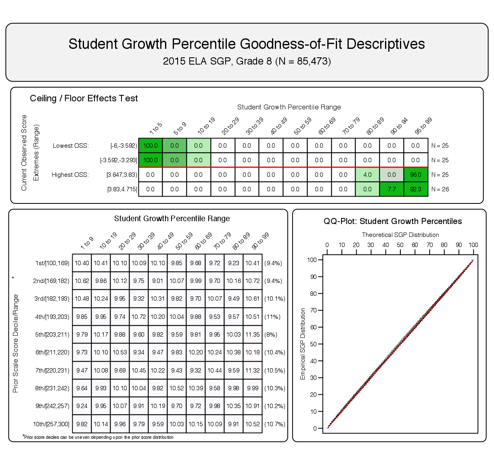
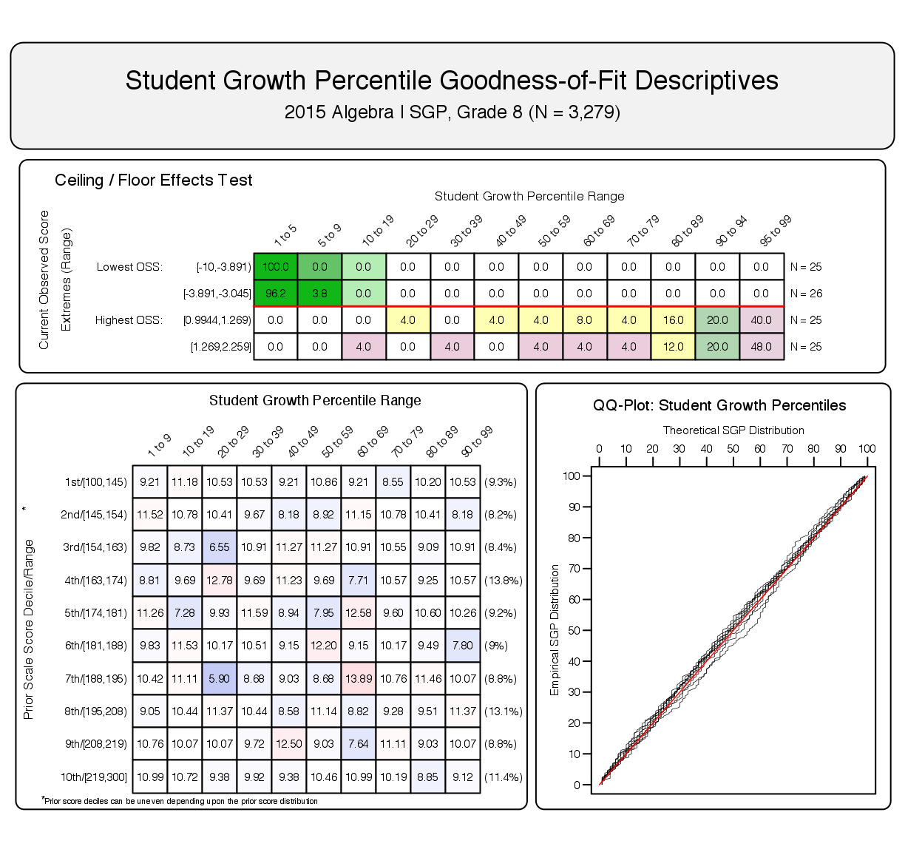

<!--SGPreport-->


<!-- 
This document was written by Damian Betebenner & Adam VanIwaarden for the New Jersey Department of Education (DOE) and PCG | Education.

	Original Draft:  January 7, 2015
	...
-->

```{r, echo=FALSE, include=FALSE}
  ## set a universal Cache path
  knitr::opts_chunk$set(cache.path = "_cache/NJ_SGP_2015")

  ##  Load some R packages and functions required for HTML table creation silently.  
  ##  Load SGP and other packages here to avoid messages.
  require(SGP)
	require(data.table)
	require(plyr)
	require(Gmisc)
  require(htmlTable)
  require(ztable)

  options(table_counter=FALSE)
  options(table_number=0)
  options("fig_caption_no"=0)
	options(fig_caption_no_sprintf = "**Figure %s:**   %s")
	options("fig_caption_no_roman"=FALSE)
	options("equation_counter" = 0)
																												
  subject_order<-c("ELA", "MATHEMATICS", 
									 "ALGEBRA_I", "ALGEBRA_II", "GEOMETRY")
	GL_subjects <- c("ELA", "MATHEMATICS")
	EOCT_subjects<-c("ALGEBRA_I", "ALGEBRA_II", "GEOMETRY")
	
	New_Jersey_SGP@Data[which(GRADE == 11 & CONTENT_AREA == "ELA"), VALID_CASE := "INVALID_CASE"]
	New_Jersey_SGP@Data[which(GRADE %in% 9:11 & CONTENT_AREA == "MATHEMATICS"), VALID_CASE := "INVALID_CASE"]
```

# Introduction

This report contains details on the implementation of the student growth percentiles (SGP) model for the state of New Jersey. The National Center for the Improvement of Educational Assessment (NCIEA) contracted with the New Jersey Department of Education (DOE) and the [Public Consulting Group (PCG | Education)](http://www.publicconsultinggroup.com/education2/) to implement the SGP methodology using data derived from the [Partnership for Assessment of Readiness for College and Careers (PARCC)](http://www.parcconline.org/) assessment program to create the New Jersey Student Growth Model. The goal of the engagement with New Jersey DOE is to create a set of open source analytic techniques and conduct analyses for all possible tested content areas and grade levels.

The SGP methodology is an open source norm- and criterion-referenced student growth analysis that produces student growth percentiles and student growth projections/targets for each student in the state with adequate longitudinal data. The methodology is currently used for many purposes. States and districts have used the results in various ways including parent/student diagnostic reporting, institutional improvement, and school and educator accountability. 

The report includes four sections covering:

- ***Data*** includes details on the decision rules used in the raw data preparation and student record validation.
- ***Analytics*** introduces some of the basic statistical methods and computational process implemented in the 2015 analyses.^[More in-depth treatment of the SGP Methodology can be found [here](https://github.com/CenterForAssessment/SGP_Resources/tree/master/articles).]
- ***SGP Results*** provides basic descriptive statistics from the 2015 analyses.
- ***Goodness of Fit*** describes how well the statistical models used to produce SGPs fit New Jersey students' data.  This includes discussion of goodness of fit plots and the student- and school-level correlations between SGP and prior achievement.

Additionally, multiple appendices are included.  Appendix A includes Goodness of Fit plots for all content areas and grades.  Appendix B provides a more technical description of the SGP methodology and statistical concepts.  Appendix C is an investigation of potential ceiling and/or floor effects present in the New Jersey PARCC assessment data and growth analyses.


<!-- HTML_Start -->
<!-- LaTeX_Start 
\pagebreak
LaTeX_End -->

# Data

Data for the New Jersey PARCC assessment used in the SGP analyses were supplied by the New Jersey DOE and PCG to the NCIEA for analysis in January 2016. The current longitudinal data set now includes academic years 2005-2006 through 2014-2015. Subsequent years' analyses will augment this multi-year data set allowing the New Jersey DOE to maintain a comprehensive longitudinal data set for all students.

Student Growth Percentiles have been produced for students that have a current score and at least one prior score in the same subject or a related content area.  SGPs were produced for English Language Arts (ELA) and Mathematics end-of-grade tests (EOGT) as in previous years, as well as for the Algebra I, Algebra II and Geometry end-of-course tests (EOCT) that are included in the PARCC assessment program.

## Longitudinal Data
Growth analyses on assessment data require data which are linked to individual students over time.  Student growth percentile analyses require, at a minimum, two years of assessment data for analysis of student progress.  To this end it is necessary that a unique student identifier be available so that student data records across years can be merged with one another and subsequently examined.  In 2015, the New Jersey SGP analyses switched the from the `esID` to the `SSID` variable in the longitudinal data as the "official" identifier.  The previous longitudinal data from years prior to 2013 did not contain the `SSID` identifier, and therefore the 2015 `esID` to `SSID` linkage was used to merge in this variable for missing prior years' data.

Because some records in the assessment data set contain students with more than one test score in a content area in a given year, a process to create unique student records in each content area by year combination is required in order to carry out subsequent growth analyses.  The following business rules were used to select the appropriate record for use in the analyses.

### Student Record Selection Business Rules

Preliminary record selection business rules for the PARCC data was performed by the PCG.  Record selection criteria used by NCIEA staff included:

1. Student records with unused grade levels (1<sup>st</sup>, 2<sup>nd</sup> and 12<sup>th</sup>) are invalidated.
2. Student records with unused test content areas (Integrated Mathematics I-III) are invalidated.
3. For students with multiple records (duplicate from the same subject and grade), the records with lowest scores are invalidated.  A total of 13 such duplicate records were present in the 2015 data.

Table `r tblNumNext()` shows the number of valid student records available for analysis by subject and grade level^[This number does not represent the number of SGPs produced, however, because students are required to have at least one prior score available as well.] and Table `r tblNumNext()+1` shows the available number of valid EOCT records.


```{r, cache=TRUE, echo=FALSE, include=FALSE}
n_tbl <- table(New_Jersey_SGP@Data[YEAR=='2015' & VALID_CASE=='VALID_CASE']$CONTENT_AREA, New_Jersey_SGP@Data[YEAR=='2015' & VALID_CASE=='VALID_CASE']$GRADE)
```
```{r, results='asis', echo=FALSE, N_tableEOGT}
	n_tbl_EOGT <- n_tbl[rownames(n_tbl) %in% GL_subjects, -which(colnames(n_tbl)=="EOCT")]
	n_tbl_EOGT <- n_tbl_EOGT[match(GL_subjects, row.names(n_tbl_EOGT)) ,]
	n_tbl_EOGT <- cbind('Content Area'=sapply(GL_subjects, capwords, special.words=c("ELA")), n_tbl_EOGT)
	n_tbl_EOGT <- prettyNum(n_tbl_EOGT, preserve.width = "individual",big.mark=',')
	n_tbl_EOGT[which(n_tbl_EOGT==0)] <- ''
	n_tbl_EOGT <- n_tbl_EOGT[, match(c('Content Area', sort(as.numeric(colnames(n_tbl_EOGT)[-1]))), colnames(n_tbl_EOGT))]
	row.names(n_tbl_EOGT) <- NULL

  cat(dualTable(as.matrix(n_tbl_EOGT), align=paste(rep('r', dim(n_tbl_EOGT)[2]), collapse=''), 
		n.cgroup=c(1, dim(n_tbl_EOGT)[2]-1), cgroup=c("", "Grades"),
		caption='Number of Valid Grade Level Student Records by Grade and Subject for 2015'))

```

```{r, results='asis', echo=FALSE, N_tableEOCT}
	n_tbl_EOCT <- as.matrix(n_tbl[rownames(n_tbl) %in% EOCT_subjects, which(colnames(n_tbl)=="EOCT")], ncol=1)
	n_tbl_EOCT <- as.matrix(n_tbl_EOCT[match(EOCT_subjects, row.names(n_tbl_EOCT)) ,], ncol=1)
	n_tbl_EOCT <- cbind('Content Area'=sapply(EOCT_subjects, capwords, special.words=c("ELA", "II", "III")), 'Valid Records' = n_tbl_EOCT)
	n_tbl_EOCT <- prettyNum(n_tbl_EOCT, preserve.width = "individual",big.mark=',')
	row.names(n_tbl_EOCT) <- NULL

	cat(dualTable(as.matrix(n_tbl_EOCT), align=paste(rep('r', dim(n_tbl_EOCT)[2]), collapse=''), 
# 		n.cgroup=c(1, dim(n_tbl_EOCT)[2]-1), compatibility="CSS",
		caption='Total Number of Valid EOCT Student Records by Subject for 2015'))
```

<!-- HTML_Start -->
<!-- LaTeX_Start 
\pagebreak
LaTeX_End -->

# Analytics

This section provides basic details about the calculation of student growth percentiles and percentile growth trajectories ('projections') from New Jersey PARCC assessment data using the [`R` Software Environment](http://www.r-project.org/) [@Rsoftware] in conjunction with the [`SGP` Package](https://github.com/CenterForAssessment/SGP) [@sgp2015].  More in depth treatment of the data analysis process with code examples is available to the PCG and NJDOE staff through [Github](https://github.com/CenterForAssessment/New_Jersey).

Broadly, the SGP analysis of the New Jersey longitudinal student assessment data takes place in two steps:

1. Data Preparation
2. Data Analysis

Those familiar with data analysis know that the bulk of the effort in the above two step process lies with Step 1: Data Preparation.  Following thorough data cleaning and preparation, data analysis using the `SGP` Package takes clean data and makes it as easy as possible to calculate, summarize, output and visualize the results from SGP analyses.

## Data Preparation

The data preparation step involves cleaning and processing data provided by the PCG using `R` and producing a `.Rdata` file that will subsequently be analyzed in Step 2. This process is carried out annually as new data become available from the state assessment program.  In 2015 the data cleaning and preparation included:

1.  Add in `SSID` identifier information based on the match with 2015 `esID` for years in which that variable is missing.  This data merge did not affect years in which `SSID` was available (no data override).
2.  Changing of `GRADE` and `CONTENT_AREA` variables to conform to [data conventions used in the `SGP` package](https://github.com/CenterForAssessment/SGP/wiki/SGP-Data-Preparation).
3.  Demographic, institution (school and district) identifier, and enrollment status variables were edited and added as necessary to conform to conventions used in the New Jersey longitudinal data from previous years' analyses.
4.  Records with data from unused grade and subjects were labeled as `INVALID_CASE`.
5.  Duplicate records (for each student based on grade and content area) are invalidated, leaving the highest score as the lone valid record.
6.  Extraneous variables were removed from the final 2015 data set.

## 2015 Data Analysis

The objective of the student growth percentile (SGP) analysis is to produce a measure which describes how (a)typical a student's growth is by examining his/her current achievement relative to students with a similar achievement history; i.e. his/her *academic peers*. The estimation of this norm-referenced growth quantity is obtained using quantile regression [@Koenker:2005] to model curvilinear functional relationships between student's prior and current scores.  One hundred such regression calculations are run for each separate analysis (defined as a unique year, content area, and grade combination).  The end product of these 100 separate regression models is a matrix of coefficient estimates, which serves as a look-up table to relate prior student achievement to current achievement for each percentile. This process ultimately leads to the calculation of thousands of regression models annually for New Jersey.  See Betebenner [-@Betebenner:2009] and Appendix B of this report for a more in-depth discussion of the SGP estimation methodology.

The 2015 New Jersey SGP analyses follow a work flow that includes the following 4 steps:

1. Create annual SGP configurations for End-of-Grade Test (EOGT) and End-of-Course Test(EOCT) analyses.
2. Update the `SGPstateData` object in the `SGP` package.  For 2015 this includes ***a)*** adding meta-data used in the calculation of student growth percentiles and projections, including the PARCC test knots and boundaries for the cubic basis splines and the test specific proficiency cutscores, and ***b)*** adding new PARCC related meta-data for the production of individual student reports (ISRs).
3. Conduct EOGT and EOCT SGP Analyses.
4. Export data, and produce summary tables and visualizations from the `New_Jersey_SGP` data object.


### Create annual SGP configurations.

The EOCT analyses are specialized enough so that it is necessary to explicitly specify the analyses to be performed via a configuration code script.  In previous years these configurations were not used because only EOGT analyses were run and they do not require configuration scripts when calculated alone^[The `SGP` software will automatically set up configurations for analyses that have a simple data structures, such as those that follow a numeric grade-level trajectory and use only the same content area for independent and dependent variables].

Each configuration specifies a set of parameters that defines the norm group of students to be examined.  Every potential norm group is defined by, at a minimum, the progressions of content area, academic year and grade-level.  Other parameters may also be defined.  Each configuration used for the New Jersey EOGT analyses contain the first three elements.  The EOCT analyses also contain the fourth and fifth elements:

- **`sgp.content.areas`:** A progression of values that specifies the content areas to be looked at and their order.
- **`sgp.panel.years`:** The progression of the years associated with the content area progression (`sgp.content.areas`) provided in the configuration, potentially allowing for skipped years, etc.
- **`sgp.grade.sequences`:** The grade progression associated with the content area and year progressions provided in the configuration. **'EOCT'** stands for 'End Of Course Test'.  The use of the generic 'EOCT' allows for secondary students to be compared based on the pattern of course taking rather than being dependent upon grade-level/class-designation.
- **`sgp.projection.grade.sequences`:** This element is used to identify the configurations that will be used to produce straight and/or lagged student growth projections.  It can, somewhat counter-intuitively, be left out or set to NULL, in which case projections will be produced and the package functions will populate the grade sequences to use based on the values provided in the `sgp.grade.sequences` element.  Alternatively, when set to "`NO_PROJECTIONS`", no projections will be produced.  For EOCT analyses, only configurations that correspond to the canonical course progressions can produce straight or lagged student growth projections.  However, since this is the first year of EOCT assessments, these progressions can not be identified (each EOCT is the "end-of-the-line" of each progression) and therefore no projections can be made.  The progressions will be codified in `SGPstateData[["NJ"]][["SGP_Configuration"]][["content_area.projection.sequence"]]` once they are established in future years.
- **`sgp.norm.group.preference`:** Because a student can potentially be included in more than one analysis/configuration, this argument provides a ranking specifying which SGP is preferable and will ultimately be the SGP matched with the student in the [`combineSGP`](https://github.com/CenterForAssessment/SGP/blob/master/R/combineSGP.R) step.  ***Lower numbers correspond with higher preference.***  Note that this configuration element is unnecessary this year in the New Jersey because it is the first year in which the EOCT assessment data is available, therefore only EOGT priors are available and those records must be unique given the data preparation business rules described above^[This also means that `sgp.norm.group.preference` is unnecessary for EOGT analyses.].
- **`sgp.exclude.sequences`:** For progressions in which a year or similar time period is skipped (i.e. a gap in time exists), grade, subject, year combinations can be identified that should identify students that should be excluded from the norm-group cohort.  For example, in a progression that goes from 8<sup>th</sup> grade Math to "`EOCT`" Algebra I with a skipped year in between one may want to exclude kids that fit into that progression, but also took either 8<sup>th</sup> grade Math or "`EOCT`" Algebra I in the skipped year (i.e. they repeated a grade/course).  Students with this different course progression and may be inappropriate to include with the cohort of students who truly had no mathematics related course in the intervening year.

The `sgp.content.areas`, `sgp.panel.years`, and `sgp.grade.sequences` elements all correspond to values found in the New Jersey PARCC data, and are used to select the subset of the longitudinal data set to be analyzed.  Only these three elements are needed for the EOGT analyses because they automatically fall into canonical projection sequences and there will not be any duplicates produced given the data cleaning process.  

As an example, here is one of the Algebra I configurations used to defined the 2015 SGP analyses:

<!-- HTML_Start -->
<!-- LaTeX_Start 
\pagebreak
LaTeX_End -->

```
...

	# Skip Year Analysis
	ALGEBRA_I.2015 = list(
		sgp.content.areas=c(rep('MATHEMATICS', 6), 'ALGEBRA_I'),
		sgp.panel.years=as.character(c(2008:2013, 2015)),
		sgp.grade.sequences=list(c('3', '4', '5', '6', '7', '8', 'EOCT')),
		sgp.exclude.sequences = data.table(VALID_CASE = 'VALID_CASE',
			CONTENT_AREA='MATHEMATICS', YEAR='2014', GRADE='8'),
		sgp.projection.grade.sequences="NO_PROJECTIONS"),

...

```

### Update New Jersey assessment meta-data

The use of higher-level functions included in the `SGP` package (e.g. `analyzeSGP`) requires the availability of state specific assessment information.  This meta-data is compiled in a `R` object named `SGPstateData` that is housed in the package.  The required updates for the 2015 analyses included ***a)*** adding meta-data used in the calculation of student growth percentiles and projections, including the PARCC test knots and boundaries for the cubic basis splines and the test specific proficiency cutscores, and ***b)*** adding new PARCC related meta-data for the production of individual student reports (ISRs).


<div class='caption'>**Calculation and addition of knots and boundaries**</div>
Calculation of SGPs includes the use of cubic B-spline basis functions to more adequately model the heteroscedasticity and non-linearity found in assessment data.^[It should be noted that the independent estimation of the regression functions can potentially result in the crossing of the quantile functions.  This occurs near the extremes of the distributions and is potentially more likely to occur given the use of non-linear functions.  A potential result of allowing the quantile functions to cross would be *lower* percentile estimations of growth for *higher* observed scale scores at the extremes (give all else equal in students' prior score histories) and vice versa.  In order to deal with these contradictory estimates, quantile regression results are isotonized to prevent quantile crossing following the methods derived by Chernozhukov, Fernandez-Val and Glichon [-@chernozhukov2010quantile].]  

These functions require the selection of boundary and interior knots.  Boundary knots are end-points outside of the scale score distribution that anchor the B-spline basis.  These are generally selected by extending the entire range of scale scores by 10%.  That is, they are defined as lying 10% below the lowest obtainable (or observed) scale score (LOSS) and 10% above the highest obtainable scale score (HOSS).  The interior knots are the *internal* breakpoints that define the spline.  The default choice in the `SGP` package [@sgp2015] is to select the 20<sup>th</sup>, 40<sup>th</sup>, 60<sup>th</sup> and 80<sup>th</sup> quantiles of the observed scale score distribution.

In general the knots and boundaries are computed from a distribution comprised of several years of test data (i.e. multiple cohorts) so that any irregularities in a single year are smoothed out.  This is important because subsequent annual analyses use these same knots and boundaries as well.  All defaults were used to compile the knots and boundaries for New Jersey from the [New Jersey Assessment of Skills and Knowledge (NJ ASK)](http://www.nj.gov/education/assessment/es/njask/) tests in previous years, and were also used in 2015 to compute the PARCC assessments' knots and boundaries using PARCC data from multiple states.


<div class='caption'>**PARCC proficiency level cutscores**</div>
Cutscores, which are set externally by the PARCC consortium through standard-setting processes, are mainly required for student growth projections. These growth projection estimates are used in the computation of adequate growth measures and elements of the ISRs.  The PARCC cutscore data was added to the `SGPstateData` by the Center for Assessment.


<div class='caption'>**ISR meta-data**</div>
Finally, meta data for the ISR production was added.  Mainly this entailed updating the `Assessment_Program_Information` and `Student_Report_Information` sections.  The entire 2015 New Jersey entry of the `SGPstateData` can be [viewed here.](https://github.com/CenterForAssessment/SGPstateData/blob/9230dab0ca10d109fc21d1db48af524cf5433063/SGPstateData.R#L4680)


### Conduct SGP Analyses.

With longitudinal data prepared appropriately, we continued to the calculation of student-level SGPs.  We use the [`updateSGP`](http://www.inside-r.org/packages/cran/SGP/docs/updateSGP) function to A) do the final preparation and addition of the new cleaned and formatted long data to the existing `SGP` data object ([`prepareSGP`](http://www.inside-r.org/packages/cran/SGP/docs/prepareSGP) step) and B) produce SGPs for the grade-level and EOCT subjects ([`analyzeSGP`](http://www.inside-r.org/packages/cran/SGP/docs/analyzeSGP) step).  


### Merge 2015 results into the longitudinal data, and output, summarize and visualize data.

Once all analyses were completed the results were merged into the master longitudinal data set ([`combineSGP`](http://www.inside-r.org/packages/cran/SGP/docs/combineSGP) step).  A pipe delimited version of the complete long data is output and submitted to the PCG ([`outputSGP`](http://www.inside-r.org/packages/cran/SGP/docs/outputSGP) step).  The data is also summarized using the `summarizeSGP` function, which produced many tables of descriptive statistics that are disaggregated at the state, district, school and other factors of interest.  Finally, visualizations (such as bubble charts and sample ISRs) are produced from the data and summary tables using the ([`visualizeSGP`](http://www.inside-r.org/packages/cran/SGP/docs/visualizeSGP) function.

<!-- HTML_Start -->
<!-- LaTeX_Start 
\pagebreak
LaTeX_End -->


# SGP Results
The following sections provide basic descriptive statistics from the 2015 analyses, including the state level mean and median growth percentiles.  Currently New Jersey uses cohort referenced SGPs as the official student level growth metric.  The interested reader can find more in depth discussions of the SGP methodology in Appendix B of this report.

## Median SGPs
Growth percentiles, being quantities associated with each individual student, can be easily summarized across numerous grouping indicators to provide summary results regarding growth.  The median and mean of a collection of growth percentiles are used as measures of central tendency that summarize the distribution as a single number.  With perfect data fit, we expect the state median of all student growth percentiles in any grade to be 50 because the data are norm-referenced across all students in the state.  Median (and mean) growth percentiles well below 50 represent growth less than the state "average" and median growth percentiles well above 50 represent growth in excess of the state "average".

To demonstrate the norm-referenced nature of the growth percentiles viewed at the state level, Table `r tblNumNext()` presents the cohort-referenced growth percentile medians and means for the EOGT content areas and `r tblNumNext()+1` shows the EOCT subjects.

```{r, cache=TRUE, echo=FALSE, include=FALSE}
	gl_smry <- New_Jersey_SGP@Data[CONTENT_AREA %in% GL_subjects & YEAR=='2015'][, list(MEDIAN = median(as.numeric(SGP), na.rm=TRUE), MEAN = round(mean(SGP, na.rm=TRUE), 1)), keyby=list(CONTENT_AREA, GRADE)][!is.na(MEDIAN)]
	gl_smry [, GRADE := as.numeric(GRADE)]
	setkey(gl_smry)
```
```{r, results='asis', echo=FALSE, sumTab_GL}
	gl_smryB <- data.frame()
	for (ca in GL_subjects){
		tmp_gl_smry <- paste(t(as.matrix(gl_smry[CONTENT_AREA==ca,][, list(MEDIAN)])), " (", t(as.matrix(gl_smry[CONTENT_AREA==ca,][, list(MEAN)])), ")", sep="")
		tmp_gl_smry <- data.frame(matrix(c(capwords(ca), tmp_gl_smry), 1, length(tmp_gl_smry)+1), stringsAsFactors = FALSE)
		names(tmp_gl_smry) <- c("Content Area", t(as.matrix(gl_smry[CONTENT_AREA==ca,][, list(GRADE)])))
		gl_smryB <- rbind.fill(gl_smryB, tmp_gl_smry)
	}
	gl_smryB[is.na(gl_smryB)] <- ""
	
  cat(dualTable(as.matrix(gl_smryB), title="", align=paste(rep('r', dim(gl_smryB)[2]), collapse=''), 
  	n.cgroup=c(1, dim(gl_smryB)[2]-1), cgroup=c("", "Grades"),
		caption='Grade Level PARCC Median (Mean) Student Growth Percentile by Grade and Content Area for 2015'))
```

```{r, cache=TRUE, echo=FALSE, include=FALSE}
	eoct_smry <- New_Jersey_SGP@Data[CONTENT_AREA %in% EOCT_subjects & YEAR=='2015'][,list("Median SGP"=median(as.numeric(SGP), na.rm=TRUE), "Mean SGP"=round(mean(SGP, na.rm=TRUE), 1)), by='CONTENT_AREA']
	setkey(eoct_smry)
```
```{r, results='asis', echo=FALSE, sumTab_EOCT}
	eoct_smry_B <- eoct_smry[match(EOCT_subjects, eoct_smry[["CONTENT_AREA"]]) ,]
	eoct_smry_B <- eoct_smry_B[, CONTENT_AREA := sapply(CONTENT_AREA, capwords, special.words=c("I", "II", "III"))]
	setnames(eoct_smry_B, "CONTENT_AREA", "Content Area")

  cat(dualTable(as.matrix(eoct_smry_B), title="", align='rcc', 
		caption='EOCT PARCC Median and Mean Student Growth Percentile by Content Area for 2015'))
```

Based upon perfect model fit to the data, the median of all state growth percentiles in each grade by year by subject combination should be 50.  That is, in the conditional distributions, 50 percent of growth percentiles should be less than 50 and 50 percent should be greater than 50.  Deviations from 50 indicate imperfect model fit to the data.  Imperfect model fit can occur for a number of reasons, some due to issues with the data (e.g., floor and ceiling effects leading to a "bunching" up of the data) as well as issues due to the way that the SGP function fits the data.  The results in Table `r tblNum()-1` and `r tblNum()` are close to perfect, with almost all values equal to 50.

The results are coarse in that they are aggregated across tens of thousands of students. More refined fit analyses are presented in the Goodness-of-Fit section that follows. Depending upon feedback from New Jersey DOE, it may be desirable to tweak with some operational parameters and attempt to improve fit even further. The impact upon the operational results based on better fit is expected to be extremely minor.

It is important to note how, at the entire state level, the *norm-referenced* growth information returns little information on annual trends due to its norm-reference nature. What the results indicate is that a typical (or average) student in the state demonstrates 50<sup>th</sup> percentile growth. That is, "typical students" demonstrate "typical growth". One benefit of the norm-referenced results follows when subgroups are examined (e.g., schools, district, demographic groups, etc.) Examining subgroups in terms of the median of their student growth percentiles, it is then possible to investigate why some subgroups display lower/higher student growth than others. Moreover, because the subgroup summary statistic (i.e., the median) is composed of many individual student growth percentiles, one can break out the result and further examine the distribution of individual results. 

<!-- HTML_Start -->
<!-- LaTeX_Start 
\pagebreak
LaTeX_End -->


# Goodness of Fit
Examination of goodness-of-fit was conducted by comparing the estimated conditional density with the theoretical uniform density of the SGPs.  Despite the use of B-splines to accommodate heteroscedasticity and skewness of the conditional density, assumptions are made concerning the number and position of spline knots that impact the percentile curves that are fit.  With an infinite population of test takers, at each prior scaled score, with perfect model fit, the expectation is to have 10 percent of the estimated growth percentiles between 1 and 9, 10 and 19, 20 and 29, ..., and 90 and 99.  Deviations from 10 percent would be indicative of lack of model fit.  


## Model Fit Plots
Using all available test scores as the variables, estimation of student growth percentiles was conducted for each possible student (those with a current score and at least one prior score).  A goodness of fit plot is produced for each unique analysis run in 2015.  Each analysis is defined by the grade and content area for the grade-level analyses and exact content area (and grade when relevant) sequences for the EOCT subjects.

The "Ceiling/Floor Effects Test" panel is intended to help identify potential problems in SGP estimation at the Highest and Lowest Obtainable (or Observed) Scale Scores (HOSS and LOSS).  If is is relatively typical for extremely high (low) achieving students to consistently score at or near the HOSS (LOSS) each year, the SGPs for these students may be unexpectedly low (high).  That is, for example, if a sufficient number of students maintain performance at the HOSS over time, this performance will be estimated as typical, and therefore SGP estimates will reflect typical growth (e.g. 50th percentile).  In some cases small deviations from these extreme score values might even yield low growth estimates.  Although these score patterns can legitimately be estimated as typical or low growth percentile, it is potentially an unfair description of student growth (and by proxy teacher or school, etc. performance).  Ultimately this is an artifact of the assessments' inability to adequately measure student performance at extreme ability levels.  

The table of values here shows whether the current year scale scores at both extremes yield the expected SGPs^[Note that the prior year scale scores are not represented here, but are critical in the SGP calculation of all students].  The expectation is that the majority of SGPs for students scoring at or near the LOSS will be low (preferably less than 5 and not higher than 10), and that SGPs for students scoring at or near the HOSS will be high (preferably higher than 95 and not less than 90).  Because few students may score *exactly* at the HOSS/LOSS^[This is particularly true when IRT Theta ($\hat{\theta}$) estimates are used rather than scaled scores, which often apply artificial LOSS/HOSS cut points.], the top/bottom 50 students are selected and any student scoring within their range of scores are selected for inclusion in these tables.  Consequently, there may be a range of scores at the HOSS/LOSS rather than a single score^[This can make the interpretation of the SGP distribution somewhat harder because current year scores not directly at the extremes do not necessarily preclude extreme SGP estimates.], and there may be more than 50 students included in the HOSS/LOSS row if the 50 students at the extremes only contain the single HOSS/LOSS score^[This also leads to potential difficulties in interpretation because with a higher number of students comes a greater distribution of prior scale scores and therefore a greater distribution of the expected SGPs.].

In either case, a more fine grained analysis of the relationship between score histories and SGPs and the associated potential for ceiling or floor effects in the models/model estimates may be necessary.  These plots are meant to serve more as a "canary in the coal mine" than as a detailed, conclusive indicator of an effect.  Appendix C of this report provides a more in depth analysis of potential ceiling or floor effects.

The bottom left panel shows the empirical distribution of SGPs given prior scale score deciles in the form of a 10 by 10 cell grid.  Percentages of student growth percentiles between the 10<sup>th</sup>, 20<sup>th</sup>, 30<sup>th</sup>, 40<sup>th</sup>, 50<sup>th</sup>, 60<sup>th</sup>, 70<sup>th</sup>, 80<sup>th</sup>, and 90<sup>th</sup> percentiles were calculated based upon the empirical decile of the cohort's prior year scaled score distribution^[The total students in each for the analyses varies depending on grade and subject.].  Deviations from perfect fit are indicated by red and blue shading. The further above 10 the darker the red, and the further below 10 the darker the blue. A more detailed discussion about the reasons for and implications of model misfit for the various SGP analysis types can be found in the "Goodness of Fit" section of the 2015 New Jersey Student Growth Model report.  

The bottom right panel of each plot is a Q-Q plot which compares the observed distribution of SGPs with the theoretical (uniform) distribution.  An ideal plot here will show black step function lines that do not deviate greatly from the ideal, red line which traces the 45 degree angle of perfect fit.

As an example, Figure `r getOption("fig_caption_no")+1` shows the results for 8<sup>th</sup> grade ELA as an example of good model fit.  Figure `r getOption("fig_caption_no")+2` is the fit plot for an Algebra I analysis that incorporates a skipped year (i.e. students with no 2014 mathematics scores), and demonstrates minor model misfit.

```{r, cache=TRUE, echo=FALSE, include=FALSE, GOFplots}
  ##    Create goodness of fit plots for tech report example
	dir.create("../img", recursive=TRUE, showWarnings=FALSE)
  setwd("../img")

  setkeyv(New_Jersey_SGP@Data, SGP:::getKey(New_Jersey_SGP))

	### ELA Grade 8 as example of GOOD fit ...
  ##  Choice of 8th grade and ELA are arbitrary ...
  ##  Keep using that from year to year to show it IS arbitrary - no need to change year to year ... ...
  
  dat <- data.table(New_Jersey_SGP@SGP[['SGPercentiles']][['ELA.2015']])
	dat <- dat[grep("2015/ELA_8", SGP_NORM_GROUP),]
	dat[, VALID_CASE := 'VALID_CASE']
	dat[, GRADE := '8']
	dat[, YEAR := '2015']
	dat[, CONTENT_AREA := "ELA"]
	setkeyv(dat, c("VALID_CASE", "CONTENT_AREA", "YEAR", "ID"))
	dat <- New_Jersey_SGP@Data[, c("VALID_CASE", "CONTENT_AREA", "YEAR", "ID", "SCALE_SCORE"), with=FALSE][dat]

	gofSGP(dat, state="NJ", years='2015', content_areas="ELA", use.sgp="SGP", output.format="PNG")

	  
  dat <- data.table(New_Jersey_SGP@SGP[['SGPercentiles']][['ALGEBRA_I.2015']])
	dat[, VALID_CASE := 'VALID_CASE']
	dat[, GRADE := '8']
	dat[, YEAR := '2015']
	dat[, CONTENT_AREA := "ALGEBRA_I"]
  dat <- dat[SGP_NORM_GROUP=="2008/MATHEMATICS_3; 2009/MATHEMATICS_4; 2010/MATHEMATICS_5; 2011/MATHEMATICS_6; 2012/MATHEMATICS_7; 2013/MATHEMATICS_8; 2015/ALGEBRA_I_EOCT"][!is.na(SCALE_SCORE_PRIOR_STANDARDIZED)]
	setkeyv(dat, c("VALID_CASE", "CONTENT_AREA", "YEAR", "ID"))
	dat <- New_Jersey_SGP@Data[, c("VALID_CASE", "CONTENT_AREA", "YEAR", "ID", "SCALE_SCORE"), with=FALSE][dat]
	gofSGP(dat, state="NJ", years='2015', content_areas='ALGEBRA_I', use.sgp="SGP", output.format="PNG")

	setwd("../2015")
```

##### `r figCapNo("Goodness of Fit Plot for 2015 8<sup>th</sup> Grade ELA:  Example of good model fit.")`


The results in all subjects are excellent with few exceptions. Deviations from perfect fit are indicated by red and blue shading.  The further *above* 10 the darker the red, and the further *below* 10 the darker the blue. In instances where large deviations from 10 occur, the likely cause is that there is a mass point associated with certain scale scores that makes it impossible to "split" the score at a dividing point forcing a majority of the scores into an adjacent cell.  This occurs more often in lower grades where fewer prior scores are available (particularly in the lowest grade when only a single prior is available). This is the case with all large deviations observed in the New Jersey data.

Misfit in the Algebra I model is likely due to the relatively small cohort size, as well as the gap in the mathematics course progression for these particular students.  The indication of a ceiling effect in this plot is probably overstated given the range of scores included in the HOSS row.  That is, the low SGPs are likely attributed to the lower scoring students, and therefore less concerning.  This situation is investigated in greater detail in Appendix C of this report.


##### `r figCapNo("Goodness of Fit Plot for 2015 Algebra I: Example of slight model mis-fit.")`


<!-- HTML_Start -->
<!-- LaTeX_Start 
\pagebreak
LaTeX_End -->


## Student Level Results
To investigate the possibility that individual level misfit might impact summary level results, student growth percentile analyses were run on all students and the results were examined relative to prior achievement.  With perfect fit to data, the correlation between students' most recent prior achievement scores and their student growth percentiles is zero (i.e., the goodness of fit tables would have a uniform distribution of percentiles across all previous scale score levels).  To investigate in another way, correlations between prior student scale scores and student growth percentiles were calculated.^[In addition to providing information about model fit, these student level correlations can assess potential impact of test ceiling effects.]  Additionally, the correlation between prior and current scale scores (achievement) are calculated to provide a contrast.  For evidence of good model fit, the desired observed relationships would be no relationship (zero correlation) between prior achievement and growth, and a positive relationship between prior and current achievement.^[A positive relationship here suggests that growth is in fact detectable and growth modeling is therefore reasonable to begin with.]

The student level correlation results are generally as expected.  With cohort-referenced percentiles, when the model is perfectly fit to the data, the correlation between students' most recent prior achievement scores and their student growth percentiles is zero (i.e., there is a uniform distribution of percentiles across all previous scale score levels).  Correlations for New Jersey cohort-referenced SGPs are all essentially zero.  This provides assurance that the models have fit the data well, and indicate that students can demonstrate high (or low) growth regardless of prior achievement using cohort-referenced SGPs.  
Furthermore, a strong relationship exists between prior and current scale scores for the grade level analyses.  The notable exception to this is the correlation for 8<sup>th</sup> grade Mathematics and 10<sup>th</sup> grade ELA.  The low mathematics correlation (0.72 in Table `r tblNumNext()`) is likely lower due to self-selection bias.  That is, many higher attaining 7<sup>th</sup> grade mathematics students likely enroll in (more advanced) Algebra I classes.  This results in a restriction of range in the observed prior scale scores, which leads to an attenuation of the correlation.  The lower ELA correlation is likely due to the fact that the prior scores for this analysis are 2013 8<sup>th</sup> grade ELA (ELA was not tested in grades higher than the 8<sup>th</sup> grade prior to 2015).

The EOCT correlations in Table `r tblNumNext()+1` are disaggregated by the constituent norm groups.  That is, each EOCT subject is potentially analyzed using more than one sequence of prior subjects, grades and years.  The norm groups here are indicated by the most recent (first) prior available for each norm group (although more prior years' scores are likely used).  These correlations are notably lower than in the grade level norm groups, partially due to the use of skipped-year sequences and the change in content area.

```{r, cache=TRUE, results='asis', echo=FALSE, Student_GL}
	student.cor.grd <- New_Jersey_SGP@Data[YEAR=='2015' & CONTENT_AREA %in% GL_subjects & VALID_CASE=='VALID_CASE'][, list(
		`$\\\rr_ {  SGP}$` = round(cor(SGP, SCALE_SCORE_PRIOR_STANDARDIZED, use='pairwise.complete'), 2), 
		`$\\\rr_ { Scale Score}$` = round(cor(SCALE_SCORE, SCALE_SCORE_PRIOR_STANDARDIZED, use='pairwise.complete'), 2), 
		# N = sum(!is.na(SGP))), by = c('CONTENT_AREA')]
		N_Size = sum(!is.na(SGP))), by = c('CONTENT_AREA', 'GRADE')]

	gl_tmp_tbl <- student.cor.grd[!is.na(student.cor.grd[["$\\\rr_ {  SGP}$"]])] 
	gl_tmp_tbl[, GRADE := as.numeric(GRADE)]
	setkey(gl_tmp_tbl, CONTENT_AREA, GRADE)
	gl_tmp_tbl <- gl_tmp_tbl[][order(match(gl_tmp_tbl$CONTENT_AREA, GL_subjects))]

	tmp.cap <- "EOGT Student Level Correlations between Prior Standardized Scale Score and 1) SGP or 2) Current Scale Score."
	gl_tmp_tbl$CONTENT_AREA <- sapply(gl_tmp_tbl$CONTENT_AREA, capwords, USE.NAMES=FALSE)
	gl_tmp_tbl$CONTENT_AREA[duplicated(gl_tmp_tbl$CONTENT_AREA)] <- ""
	gl_tmp_tbl$N_Size <- prettyNum(gl_tmp_tbl$N_Size, preserve.width = "individual", big.mark=',')
	setnames(gl_tmp_tbl, c(1:2,5), sapply(names(gl_tmp_tbl)[c(1:2,5)], capwords))

  cat(dualTable(as.matrix(gl_tmp_tbl), align=paste(rep('r', dim(gl_tmp_tbl)[2]), collapse=''), caption = tmp.cap))
```

```{r, cache=TRUE, results='asis', echo=FALSE, Student_EOCT}
	student.cor.eoct <- New_Jersey_SGP@Data[YEAR=='2015' & CONTENT_AREA %in% EOCT_subjects & VALID_CASE=='VALID_CASE'][, list(
		`$\\\rr_ {  SGP}$` = round(cor(SGP, SCALE_SCORE_PRIOR_STANDARDIZED, use='pairwise.complete'), 2), 
		`$\\\rr_ { Scale Score}$` = round(cor(SCALE_SCORE, SCALE_SCORE_PRIOR_STANDARDIZED, use='pairwise.complete'), 2), 
		# N = sum(!is.na(SGP))), by = c('CONTENT_AREA')]
		N_Size = sum(!is.na(SGP))), keyby = list(CONTENT_AREA, First_Prior)]

	eoct_tmp_tbl <- student.cor.eoct[!is.na(student.cor.eoct[["$\\\rr_ {  SGP}$"]])] 
	eoct_tmp_tbl[, First_Prior := paste(sapply(strsplit(First_Prior, "/"), function(y) y[1]), sapply(sapply(strsplit(sapply(strsplit(First_Prior, "/"), function(y) y[2]), "_"), function(c) paste(c, collapse = " Grade ")), capwords))]
	
	eoct_tmp_tbl <- eoct_tmp_tbl[][order(match(eoct_tmp_tbl$CONTENT_AREA, EOCT_subjects))]
	eoct_tmp_tbl$CONTENT_AREA <- sapply(eoct_tmp_tbl$CONTENT_AREA, capwords, USE.NAMES=FALSE)

	tmp.cap <- "EOCT Student Level Correlations between Prior Standardized Scale Score and 1) SGP or 2) Current Scale Score - Disaggregated by Norm Group."
	eoct_tmp_tbl$CONTENT_AREA <- sapply(eoct_tmp_tbl$CONTENT_AREA, capwords, USE.NAMES=FALSE)
	eoct_tmp_tbl$CONTENT_AREA[duplicated(eoct_tmp_tbl$CONTENT_AREA)] <- ""
	eoct_tmp_tbl$N_Size <- prettyNum(eoct_tmp_tbl$N_Size, preserve.width = "individual", big.mark=',')
	setnames(eoct_tmp_tbl, c(1:2,5), sapply(names(eoct_tmp_tbl)[c(1:2,5)], capwords))

  cat(dualTable(as.matrix(eoct_tmp_tbl), align=paste(rep('r', dim(eoct_tmp_tbl)[2]), collapse=''), caption = tmp.cap))
```

## Group Level Results
Unlike when reporting SGPs at the individual level, when aggregating to the group level (e.g., school) the correlation between aggregate prior student achievement and aggregate growth is rarely zero. The correlation between prior student achievement and growth at the school level is a compelling descriptive statistic because it indicates whether students attending schools serving higher achieving students grow faster (on average) than those students attending schools serving lower achieving students. Results from previous state analyses show a correlation between prior achievement of students associated with a current school (quantified as percent at/above proficient) and the median SGP are typically between 0.1 and 0.3 (although higher numbers have been observed in some states as well). That is, these results indicate that on average, students attending schools serving lower achieving students tend to demonstrate less exemplary growth than those attending schools serving higher achieving students. Equivalently, based upon ordinary least squares (OLS) regression assumptions, the prior achievement level of students attending a school accounts for between 1 and 10 percent of the variability observed in student growth. There are no definitive numbers on what this correlation should be, but recent studies on value-added models show similar results [@MccaLock:2008].

### School Level Results

To illustrate these relationships visually, the bubble charts in Figures `r getOption("fig_caption_no")+1` and `r getOption("fig_caption_no")+2` depict growth as quantified by the median SGP of students at the school against achievement/status, quantified by percentage of student at/above proficient at the school^[Percent Prior Proficient in this case is determined by the percent of student's that scored in the Proficient or Advanced range of all student's that received a score.  This measure does not reflect student's that did not receive a score.]. The charts have been successful in helping to motivate the discussion of the two qualities: student achievement and student growth. Though the figures are not detailed enough to indicate strength of relationship between growth and achievement, they are suggestive and valuable for discussions with stakeholders who are being introduced to the growth model for the first time.

```{r, cache=TRUE, results='asis', echo=FALSE, include=FALSE, Bubble_Plots}
  visualizeSGP(New_Jersey_SGP,
		plot.types="bubblePlot",
		bPlot.content_areas=c("ELA", "MATHEMATICS"),
		bPlot.years="2015",
		bPlot.output="PNG",
		bPlot.format="presentation",
		bPlot.folder="../img/Bubble_Plots")
```

##### `r figCapNo("School Level Bubble Plots for New Jersey:  ELA, 2014-2015.")`
.png)

<p></p>
<p></p>

##### `r figCapNo("School Level Bubble Plots for New Jersey:  Mathematics, 2014-2015.")`
.png)

<!-- HTML_Start -->
<!-- LaTeX_Start 
\pagebreak
LaTeX_End -->

The relationship between average prior student achievement and median SGP observed for New Jersey is relatively strong compared to some other states for which the Center has done SGP analyses, although there is a considerable decrease in the strength of relationship in 2015 relative to previous years.  Table `r tblNumNext()` shows correlations between prior achievement (measured as the mean prior standardized scale score as well as the percent at/above proficient at the school^[Percent Prior Proficient in this case is determined by the percent of student's that scored in the Proficient or Advanced range of all student's that received a score.  This measure does not reflect student's that did not receive a score but are included in the denominator of percent proficient.]) and both gowth and current achievement.  All results shown here are for schools with 10 or more students.


```{r, cache=TRUE, echo=FALSE, include=FALSE}
	sch.msgp <- New_Jersey_SGP@Summary$SCHOOL_NUMBER$SCHOOL_NUMBER__YEAR__SCHOOL_ENROLLMENT_STATUS[!is.na(SCHOOL_NUMBER) & MEDIAN_SGP_COUNT > 9]
	sch.msgp.subj <- New_Jersey_SGP@Summary$SCHOOL_NUMBER$SCHOOL_NUMBER__CONTENT_AREA__YEAR__SCHOOL_ENROLLMENT_STATUS[!is.na(SCHOOL_NUMBER) & MEDIAN_SGP_COUNT > 9]
	sch.msgp.grd <- New_Jersey_SGP@Summary$SCHOOL_NUMBER$SCHOOL_NUMBER__CONTENT_AREA__YEAR__GRADE__SCHOOL_ENROLLMENT_STATUS[YEAR == '2015' & !is.na(SCHOOL_NUMBER) & MEDIAN_SGP_COUNT > 9]
	sch.msgp.grd$CONTENT_AREA <- ordered(sch.msgp.grd$CONTENT_AREA, levels = c(GL_subjects, EOCT_subjects))
	##  Combined subjects - School_Cor_Grand
	sch.cor <- sch.msgp[, list(
						MEDIAN_SGP = round(cor(MEDIAN_SGP, MEAN_SCALE_SCORE_PRIOR_STANDARDIZED, use="complete"), 2),
						MEAN_SGP = round(cor(MEAN_SGP, MEAN_SCALE_SCORE_PRIOR_STANDARDIZED, use="complete"), 2),
						PCT_PROFICIENT_OR_ABOVE = round(cor(PERCENT_AT_ABOVE_PROFICIENT, MEAN_SCALE_SCORE_PRIOR_STANDARDIZED, use="complete"), 2)), by = 'YEAR']
	##  Multiple year - School_Correlations
	sch.cor.subj <- sch.msgp.subj[, list(
						MEDIAN_SGP = round(cor(MEDIAN_SGP, MEAN_SCALE_SCORE_PRIOR_STANDARDIZED, use="complete"), 2),
						MEAN_SGP = round(cor(MEAN_SGP, MEAN_SCALE_SCORE_PRIOR_STANDARDIZED, use="complete"), 2),		
						PCT_PROFICIENT_OR_ABOVE = round(cor(PERCENT_AT_ABOVE_PROFICIENT, MEAN_SCALE_SCORE_PRIOR_STANDARDIZED, use="complete"), 2)), by = c('CONTENT_AREA', 'YEAR')]		
	## 2015 by grade - School_Grade_Correlations
	sch.cor.grd <- sch.msgp.grd[, list(
						MEDIAN_SGP = round(cor(MEDIAN_SGP, MEAN_SCALE_SCORE_PRIOR_STANDARDIZED, use="complete"), 2),
						MEAN_SGP = round(cor(MEAN_SGP, MEAN_SCALE_SCORE_PRIOR_STANDARDIZED, use="complete"), 2),
						PCT_PROFICIENT_OR_ABOVE = round(cor(PERCENT_AT_ABOVE_PROFICIENT, MEAN_SCALE_SCORE_PRIOR_STANDARDIZED, use="complete"), 2)), by = c('CONTENT_AREA', 'GRADE')]

	sch.cor.grd <- sch.cor.grd[order(match(sch.cor.grd$CONTENT_AREA, c(GL_subjects, EOCT_subjects))),]

	gl_cor_tbl <- sch.cor.grd[CONTENT_AREA %in% GL_subjects]
	gl_cor_tbl[, GRADE := as.numeric(GRADE)]
	setkey(gl_cor_tbl, CONTENT_AREA, GRADE)

```

```{r, results='asis', echo=FALSE, School_Cor_Grand}
	tmp_tbl <- data.frame(sch.cor)
	tmp.cap <- "School Level Correlations between Mean Prior Standardized Scale Score and 1) Aggregate SGPs or 2) Aggregate Current Scale Score - (Combined Subjects)"
	names(tmp_tbl) <- sapply(names(tmp_tbl), capwords)

	cat(dualTable(as.matrix(tmp_tbl), align=paste(rep('r', dim(tmp_tbl)[2]), collapse=''), caption  = tmp.cap))
```
<p></p>

Correlation tables describing the relationship between prior achievement (again defined as mean prior standardized scale score) and aggregate growth percentiles are presented below in separate subsections for grade level and EOCT subjects.  Additionally, the correlation between the groups prior achievement and a measure of their current achievement (here the percent of kids that are at or above the proficiency cuts).  Typically these correlations are stronger than that between prior achievement and growth, which suggests that school achievement *status* tends to stay the same over time.  

This is indeed what we see in the correlation tables. The first table in the each subsection provides these overall SGP aggregates' relationships with mean prior standardized scale scores. The additional correlation tables are dis-aggregated by content area, and content area and grade to provide more detail.

<p></p>

```{r, results='asis', echo=FALSE, School_Correlations}
	tmp_tbl <- sch.cor.subj[order(match(sch.cor.subj$CONTENT_AREA, GL_subjects)),][CONTENT_AREA %in% GL_subjects]
	tmp.cap <- "School Level EOGT Correlations between Mean Prior Standardized Scale Score and 1) Aggregate SGPs or 2) Aggregate Current Scale Score by Content Area."	
	tmp_tbl$CONTENT_AREA <- sapply(tmp_tbl$CONTENT_AREA, capwords, USE.NAMES=FALSE)
	tmp_tbl$CONTENT_AREA[duplicated(tmp_tbl$CONTENT_AREA)] <- ""
	setnames(tmp_tbl, sapply(names(tmp_tbl), capwords))

	tmp_tbl[is.na(tmp_tbl)] <- ""

	cat(dualTable(as.matrix(tmp_tbl), align=paste(rep('r', dim(tmp_tbl)[2]), collapse=''), caption  = tmp.cap))
```


```{r, results='asis', echo=FALSE, School_EOCT_Cor}
	tmp_tbl <- sch.cor.subj[order(match(sch.cor.subj$CONTENT_AREA, EOCT_subjects)),][CONTENT_AREA %in% EOCT_subjects]
	tmp.cap <- "2013 to 2015 School Level EOCT Correlations between Mean Prior Standardized Scale Score and 1) Aggregate SGPs or 2) Aggregate Current Scale Score by Content Area."
	tmp_tbl$CONTENT_AREA <- sapply(tmp_tbl$CONTENT_AREA, capwords, USE.NAMES=FALSE)
	tmp_tbl$CONTENT_AREA[duplicated(tmp_tbl$CONTENT_AREA)] <- ""
	setnames(tmp_tbl, sapply(names(tmp_tbl), capwords))

	tmp_tbl[is.na(tmp_tbl)] <- ""

	cat(dualTable(as.matrix(tmp_tbl), align=paste(rep('r', dim(tmp_tbl)[2]), collapse=''), caption = tmp.cap))
```

The final table disaggregates the 2015 correlations for the EOGT subjects further by grade level.

```{r, results='asis', echo=FALSE, School_Grade_Correlations}
	tmp.cap <- "2015 School Level EOGT Correlations between Mean Prior Standardized Scale Score and 1) Aggregate SGPs or 2) Aggregate Current Scale Score by Grade."
	gl_cor_tbl$CONTENT_AREA <- sapply(gl_cor_tbl$CONTENT_AREA, capwords)
	gl_cor_tbl$CONTENT_AREA[duplicated(gl_cor_tbl$CONTENT_AREA)] <- ""
	setnames(gl_cor_tbl, sapply(names(gl_cor_tbl), capwords))

	cat(dualTable(as.matrix(gl_cor_tbl), align=paste(rep('r', dim(gl_cor_tbl)[2]), collapse=''), caption = tmp.cap))
```

<!-- HTML_Start -->
<!-- LaTeX_Start 
\pagebreak
LaTeX_End -->

# References
